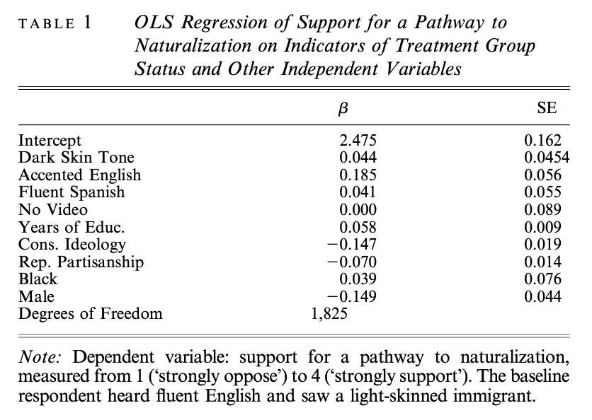
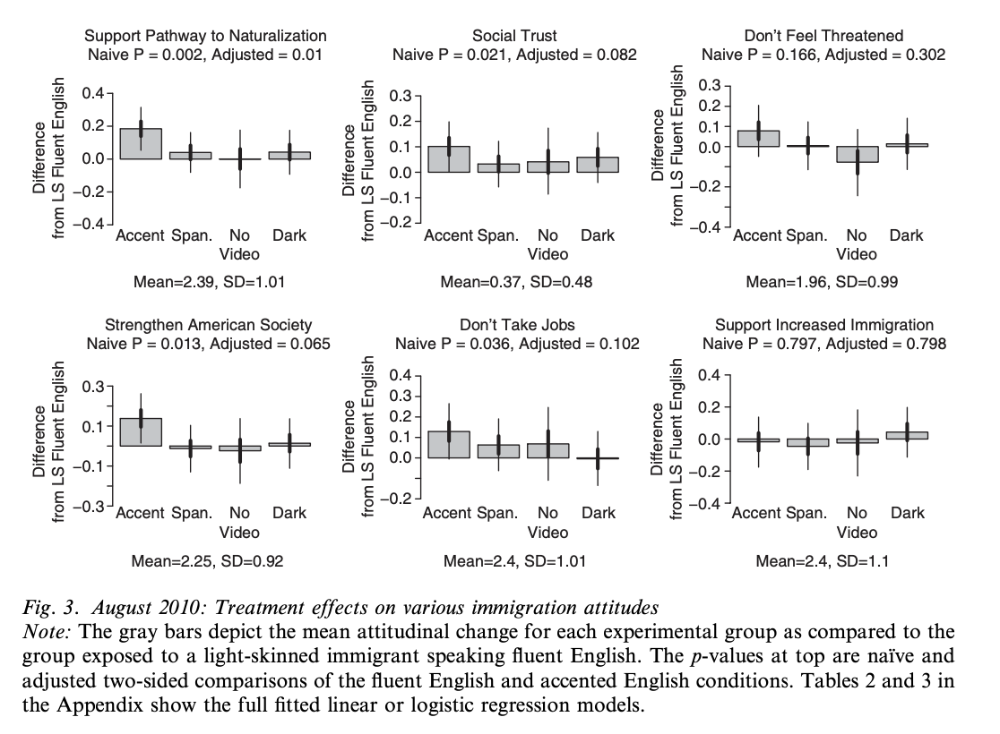

```{r setup, include=FALSE}
knitr::opts_chunk$set(echo = TRUE)

# Removed knitr bib options line; otherwise, bib file
# kept being overwritten with old version.

library(gt)
library(sjPlot)
library(janitor)
library(rstanarm)
library(tidyverse)


# Read cleaned data from clean-data.

exp1_cleaned <- read_rds("clean-data/exp1_cleaned.rds") %>% 
  clean_names()
exp2_cleaned <- read_rds("clean-data/exp2_cleaned.rds") %>% 
  clean_names()
```

## Introduction

This is my PDF document. You may also refer to the Github repo of my final project.^[All analysis for this project can be found at https://github.com/kevpwang/replication_project.git]

<!-- must actually reference texts to generate bibliography -->

My project replicates @hopkins. My other references are @R-knitr, @R-stringr, @knitr2015, and @knitr2014.

## Overview

@hopkins builds on prior research and sociological theory suggesting that observation of immigrants' "culturally distinctive" traits induces anti-immigrant attitudes in members of society from the dominant cultural background. Hopkins seeks to empirically determine whether immigrants who appear more "culturally distinctive" generate more hostile responses. Specifically, noting the rapid growth of Hispanic immigration to the US, Hopkins shows a nationally representative sample of non-Hispanic Americans videos, adapted from an ABC news clip, of an "undocumented Hispanic immigrant" expressing support for assimilation and a path to citizenship. The video is edited such that the immigrant is blurred, appears either visibly dark- or light-skinned, and speaks either fluent Spanish, fluent but subtly accented English, or broken English. 8 percent of the sample, the control group, were not shown any video, while the remaining 92 percent was randomly assigned to one of six possible videos (combinations of skin tone and English fluency). After the video, the sample was surveyed about their opinion on a path to citizenship for undocumented immigrants, with answers corresponding to a numerical scale of 1 ("strongly oppose") to 4 ("strongly support"). They were also surveyed on five other immigration-related questions.

Hopkins runs a linear regression on attitudes toward a path to citizenship using skin tone, video language fluency, respondent years of education, conservatism, partisanship, race (white/black), and gender as explanatory variables. He also runs linear or logistic regressions between each of the other five questions and video language fluency. The principal results of the paper relate to the effect of skin tone and language. Hopkins finds that skin tone does not meaningfully shift change attitudes. Moreover, contrary to expectations that more distinctive traits would engender greater hostility, Hopkins finds no difference between exposure to fluent English or Spanish, and significantly increased support for a pathway to citizenship among those who heard broken English. Hopkins theorizes that rather than reinforce perceptions of cultural difference, a broken English speaker actually challenges stereotypes by exemplifying immigrants' desire to assimilate with American norms.

## Beautiful Graphic

```{r Linear Q7 model, echo = FALSE}

# Regression analysis for Q7: path to citizenship 

exp1_q7 <- exp1_cleaned %>% 
  
  # Hopkins excludes Hispanics; sensible to exclude people who refused to answer Q7
  
  filter(ppethm != "Hispanic") %>% 
  filter(q7 != -1)

q7_model <- stan_glm(q7 ~ dark + accented + spanish + video + years_educ + conservative + republican + 
                       black + male, data = exp1_q7, refresh = 0)
```

```{r Replicate Figure 2, echo = FALSE}
var_list <- c("accented", "spanish", "video")
parameters <- tibble(condition = c("Accented English", "Fluent Spanish", "No Video (Control)"),
       coef = map_dbl(var_list, ~pluck(coef(q7_model), .x)),
       sd = map_dbl(var_list, ~pluck(se(q7_model), .x))
)
ggplot(parameters, aes(x = condition, y = coef)) +
  geom_col(alpha = 0.5, color = "black") +
  geom_errorbar(aes(ymin = coef - sd, ymax = coef + sd), size = 1, width = 0) +
  geom_errorbar(aes(ymin = coef - 2 * sd, ymax = coef + 2 * sd), width = 0) +
  scale_y_continuous(limits = c(-.4, 0.4)) +
  labs(
    title = "Support for Pathway to Naturalization",
    subtitle = "Subjects who heard broken English display significantly more pro-immigrant attitudes",
    x = "Treatment",
    y = "Difference from Fluent English"
    )
```

The gray bars depict the difference in subjects' support for a path to naturalization compared to that of subjects who saw a light-skinned immigrant fluently speaking English. Support is measured numerically from 1 (strongly oppose) to 4 (strongly support). The thick vertical lines represent the interval of one standard error, while the thin vertical lines represent the 95 percent conficence interval.

## Appendix

#### Table 1 from @hopkins:



#### Replication:

```{r Replicate Table 1, echo = FALSE}
tab_model(q7_model,
          title = "OLS Regression of Support for a Pathway to Naturalization on Indicators of Treatment
          Group Status and Other Independent Variables",
          show.se = TRUE,
          show.ci = FALSE,
          show.r2 = FALSE,
          digits = 3,
          dv.labels = " ",
          pred.labels = c("Intercept", "Dark Skin Tone", "Accented English", "Fluent Spanish",
                        "No Video", "Years of Educ.", "Cons. Ideology", "Rep. Partisanship",
                        "Black", "Male"))
```

#### Figure 2 from @hopkins:


#### Replication:

See under heading "Beautiful Graphic".

#### Figure 3 from @hopkins:



#### Replication:

```{r Replicate Figure 3, echo = FALSE}
q7_model <- stan_glm(q7 ~ dark + accented + spanish + video + years_educ + conservative + republican + 
                       black + male, data = exp1_q7, refresh = 0)

exp1_q8 <- exp1_cleaned %>% 
  filter(ppethm != "Hispanic") %>% 
  filter(q8 != -1)

q8_model <- stan_glm(q8 ~ dark + accented + spanish + video + years_educ + conservative + republican + 
                       black + male, data = exp1_q8, refresh = 0)

exp1_q9 <- exp1_cleaned %>% 
  filter(ppethm != "Hispanic") %>% 
  filter(q9 != -1)

q9_model <- stan_glm(q9 ~ accented + english + spanish + dark + years_educ + conservative + republican + 
                       black + male, data = exp1_q9, refresh = 0)

exp1_q10 <- exp1_cleaned %>% 
  filter(ppethm != "Hispanic") %>% 
  filter(q10 != -1)

q10_model <- stan_glm(q10 ~ accented + english + spanish + dark + years_educ + conservative + republican + 
                       black + male, data = exp1_q10, refresh = 0)

exp1_q12a <- exp1_cleaned %>% 
  filter(ppethm != "Hispanic") %>% 
  drop_na(q12a) %>% 
  filter(q12a != -1)

q12a_model <- stan_glm(q12a ~ accented + english + spanish + dark + years_educ + conservative + republican + 
                       black + male, family = "binomial", data = exp1_q12a, refresh = 0)

exp1_q13 <- exp1_cleaned %>% 
  filter(ppethm != "Hispanic") %>% 
  filter(q13 != -1)

q13_model <- stan_glm(q13 ~ accented + english + spanish + dark + years_educ + conservative + republican + 
                       black + male, data = exp1_q13, refresh = 0)
```

#### Figure 4 from @hopkins:


#### Replication:

#### Appendix A, Figure 1 from @hopkins:


#### Replication:

#### Appendix C, Table 1 from @hopkins:


#### Replication:

```{r Replicate App C Table 1, echo = FALSE}
exp1_tab1 <- exp1_cleaned %>% 
  filter(ppethm != "Hispanic") %>% 
  select(income, years_educ, online, employed, conservative,
         republican, black, other, ppage)

# Repeat same recodings for 2nd survey data.

exp2_tab1 <- exp2_cleaned %>% 
  filter(ppethm != "Hispanic") %>% 
  select(income, years_educ, online, employed, conservative,
         republican, black, other, ppage)

table <- tibble(labels = c("Income", "Years of Education", "Online", "Employed",
                           "Conservative", "Republica", "Black", "Other", "Age"),
                mean1 = colMeans(exp1_tab1),
                sd1 = apply(exp1_tab1, 2, sd),
                min1 = apply(exp1_tab1, 2, min),
                max1 = apply(exp1_tab1, 2, max),
                mean2 = colMeans(exp2_tab1),
                sd2 = apply(exp2_tab1, 2, sd),
                min2 = apply(exp2_tab1, 2, min),
                max2 = apply(exp2_tab1, 2, max)
                )
table %>% 
  gt() %>% 
  tab_spanner(
    label = "August 2010 Experiment",
    columns = vars(mean1, sd1, min1, max1)
  ) %>% 
  tab_spanner(
    label = "January 2011 Experiment",
    columns = vars(mean2, sd2, min2, max2)
  ) %>% 
  fmt_number(
    decimals = 2,
    columns = vars(mean1, sd1, min1, max1, 
                   mean2, sd2, min2, max2)
  ) %>% 
  cols_label(
    labels = "",
    mean1 = "Mean",
    sd1 = "SD",
    min1 = "Min.",
    max1 = "Max.",
    mean2 = "Mean",
    sd2 = "SD",
    min2 = "Min.",
    max2 = "Max.",
  )
```

The most significant differences between @hopkins and my replication are income and education. For income, the published data only gives ranges, not exact values. I decided to recode using the floor of each range (e.g. "5000 to 7499" becomes 5000) in order to get an accurate minimum value; this predictably results in my mean value being lower than @hopkins. Similarly, in many cases, the data only gives educational attainment (e.g. "some college", "professional/graduate") and not exact years, so I had to make some assumptions while recoding (e.g. coding "professional/graduate" as 20 years by default). Once again, this predictably results in differences between my values and @hopkins, though less significantly so than for income.

#### Appendix C, Table 2 from @hopkins:


#### Replication:

```{r Replicate App C Table 2, echo = FALSE}

# Regression analyses for Q7, Q8: legal immigration, & Q9: generic threat.
# Exclude refusals to answer.

q7_model <- stan_glm(q7 ~ accented + english + spanish + dark + years_educ + conservative + republican + 
                       black + male, data = exp1_q7, refresh = 0)

exp1_q8 <- exp1_cleaned %>% 
  filter(ppethm != "Hispanic") %>% 
  filter(q8 != -1)

q8_model <- stan_glm(q8 ~ accented + english + spanish + dark + years_educ + conservative + republican + 
                       black + male, data = exp1_q8, refresh = 0)

exp1_q9 <- exp1_cleaned %>% 
  filter(ppethm != "Hispanic") %>% 
  filter(q9 != -1)

q9_model <- stan_glm(q9 ~ accented + english + spanish + dark + years_educ + conservative + republican + 
                       black + male, data = exp1_q9, refresh = 0)

tab_model(q7_model, q8_model, q9_model,
          show.se = TRUE,
          show.ci = FALSE,
          show.r2 = FALSE,
          digits = 3,
          dv.labels = c("Pathway", "Legal Immig.", "Generic Threat"),
          pred.labels = c("Intercept", "Accented", "English", "Spanish", "Dark Skin",
                        "Education", "Conservative Ideo.", "Republican ID",
                        "Black", "Male"))
```

#### Appendix C, Table 3 from @hopkins:


#### Replication:

```{r Replicate App C Table 3, echo = FALSE}

# Regression analyses for Q10: strengthens America, Q12a: social trust, & Q13: job threat.
# Exclude refusals to answer.

exp1_q10 <- exp1_cleaned %>% 
  filter(ppethm != "Hispanic") %>% 
  filter(q10 != -1)

q10_model <- stan_glm(q10 ~ accented + english + spanish + dark + years_educ + conservative + republican + 
                       black + male, data = exp1_q10, refresh = 0)

exp1_q12a <- exp1_cleaned %>% 
  filter(ppethm != "Hispanic") %>% 
  drop_na(q12a) %>% 
  filter(q12a != -1)

q12a_model <- stan_glm(q12a ~ accented + english + spanish + dark + years_educ + conservative + republican + 
                       black + male, family = "binomial", data = exp1_q12a, refresh = 0)

exp1_q13 <- exp1_cleaned %>% 
  filter(ppethm != "Hispanic") %>% 
  filter(q13 != -1)

q13_model <- stan_glm(q13 ~ accented + english + spanish + dark + years_educ + conservative + republican + 
                       black + male, data = exp1_q13, refresh = 0)

tab_model(q10_model, q12a_model, q13_model,
          show.se = TRUE,
          show.ci = FALSE,
          show.r2 = FALSE,
          transform = NULL,
          digits = 3,
          dv.labels = c("Strengthen America", "Social Trust", "Job Threat"),
          pred.labels = c("Intercept", "Accented", "English", "Spanish", "Dark Skin",
                        "Education", "Conservative Ideo.", "Republican ID",
                        "Black", "Male"))
```

#### Appendix C, Table 4 from @hopkins:


#### Replication:

```{r Replicate App C Table 4, echo = FALSE}

```

## References