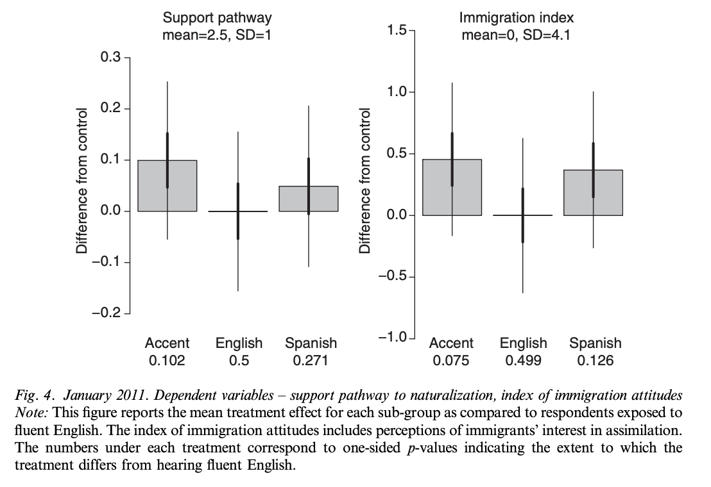
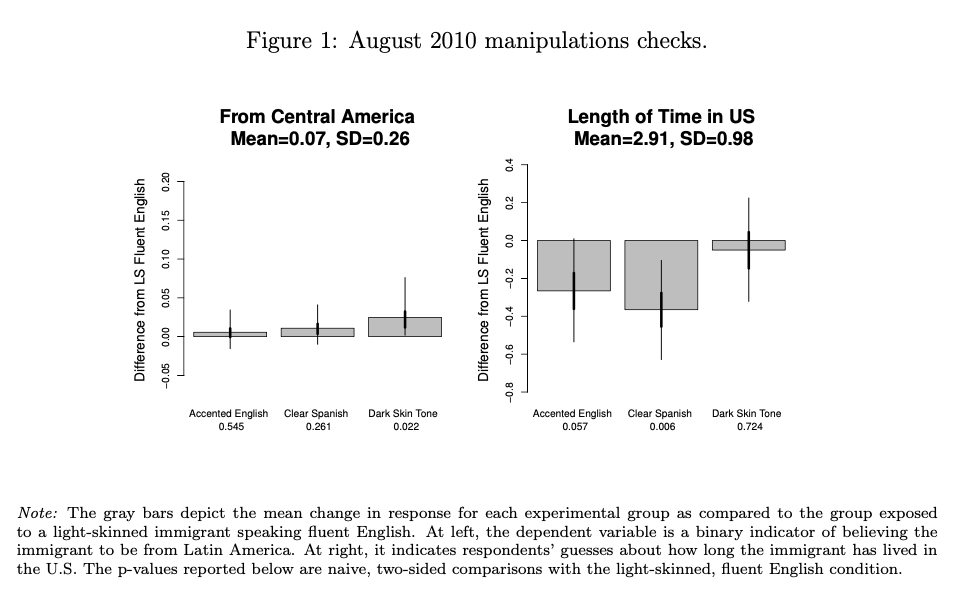
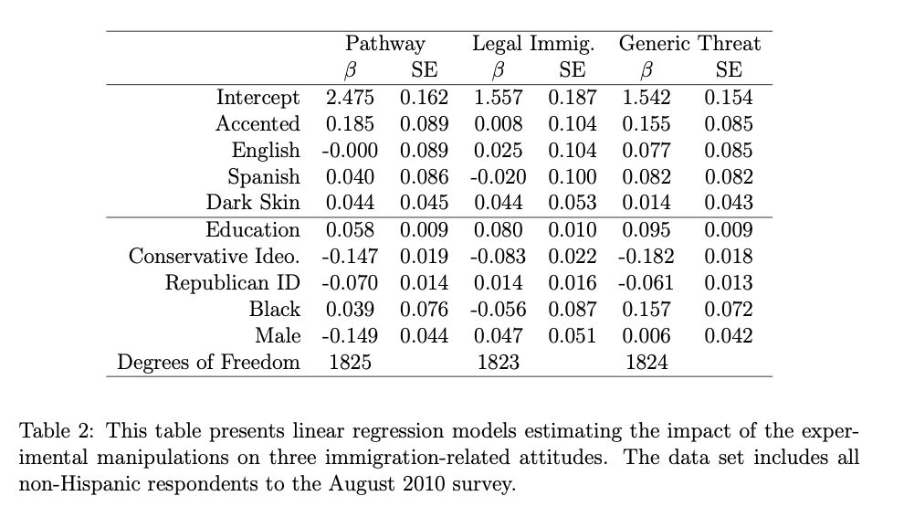
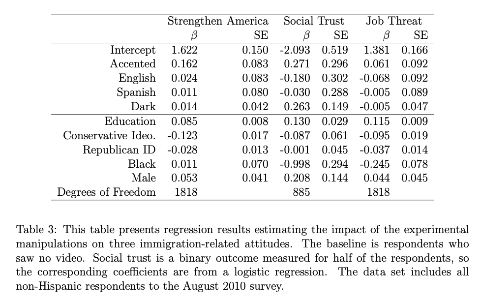

```{r setup, include=FALSE}
knitr::opts_chunk$set(echo = TRUE)

# Removed knitr bib options line; otherwise, bib file
# kept being overwritten with old version.

library(gt)
library(sjPlot)
library(ggpubr)
library(janitor)
library(rstanarm)
library(tidyverse)


# Read cleaned data from clean-data.

exp1_cleaned <- read_rds("clean-data/exp1_cleaned.rds") %>% 
  clean_names()
exp2_cleaned <- read_rds("clean-data/exp2_cleaned.rds") %>% 
  clean_names()
```

## Introduction

This is my PDF document. You may also refer to the Github repo of my final project.^[All analysis for this project can be found at https://github.com/kevpwang/replication_project.git]

<!-- must actually reference texts to generate bibliography -->

My final project is based on @king and replicates @hopkins. My other references are @knitr2015, and @knitr2014.

## Overview

@hopkins builds on prior research and sociological theory suggesting that observation of immigrants' "culturally distinctive" traits induces anti-immigrant attitudes in members of society from the dominant cultural background. Hopkins seeks to empirically determine whether immigrants who appear more "culturally distinctive" generate more hostile responses. Specifically, noting the rapid growth of Hispanic immigration to the US, Hopkins shows a nationally representative sample of non-Hispanic Americans videos, adapted from an ABC news clip, of an "undocumented Hispanic immigrant" expressing support for assimilation and a path to citizenship. The video is edited such that the immigrant is blurred, appears either visibly dark- or light-skinned, and speaks either fluent Spanish, fluent but subtly accented English, or broken English. 8 percent of the sample, the control group, were not shown any video, while the remaining 92 percent was randomly assigned to one of six possible videos (combinations of skin tone and English fluency). After the video, the sample was surveyed about their opinion on a path to citizenship for undocumented immigrants, with answers corresponding to a numerical scale of 1 ("strongly oppose") to 4 ("strongly support"). They were also surveyed on five other immigration-related questions.

Hopkins runs a linear regression on attitudes toward a path to citizenship using skin tone, video language fluency, respondent years of education, conservatism, partisanship, race (white/black), and gender as explanatory variables. He also runs linear or logistic regressions between each of the other five questions and video language fluency. The principal results of the paper relate to the effect of skin tone and language. Hopkins finds that skin tone does not meaningfully shift change attitudes. Moreover, contrary to expectations that more distinctive traits would engender greater hostility, Hopkins finds no difference between exposure to fluent English or Spanish, and significantly increased support for a pathway to citizenship among those who heard broken English. Hopkins theorizes that rather than reinforce perceptions of cultural difference, a broken English speaker actually challenges stereotypes by exemplifying immigrants' desire to assimilate with American norms.

## Beautiful Graphic


## Replication Progress

I was able to replicate all but three charts and tables from @hopkins. I am not able to replicate Appendix A, Figure 1 because it is not entirely clear where that data is in the dataset and how to process it, but I anticipate coming up with a method soon. I can only partially replicate Figure 4 and Appendix C, Table 4 because the method for calculating the six-question index is not specified anywhere in the paper; I may have to email Hopkins and ask. The only additional aspect I am unable to replicate is the "free step-down resampling method" for generating the appropriate corrected p-values for Figure 3.

## Proposed Extension

In both the August 2010 and January 2011 surveys, all respondents are asked the following question: "In your day-to-day life, how frequently do you hear Spanish spoken? Never or almost never, less than once a month, 1-3 times each month, at least once a week, or every day?" @hopkins does not include responses to this question in its analysis of effects on attitude changes.

A promising extension of @hopkins would be to examine differences in attitude changes grouped by the frequency at which respondents hear Spanish spoken. Based on a cursory glance of the responses to this question in the August 2010 survey, a significant plurality of respondents, 42 percent, report hearing Spanish spoken every day, while another 28 percent report hearing Spanish spoken at least once a week. The apparent lack of exclusionary responses may be influenced by such widespread familiarity with Spanish among respondents, whereas other respondents less familiar with Spanish in their daily lives may exhibit exclusionary responses for which the current analysis is not accounting. This idea has foundations in other research. For example, @enos finds that when culturally distinctive Spanish speakers are introduced to a predominantly white, upper-income subway commute route, overall attitudes toward immigration become more hostile. It could similarly be the case in @hopkins that the only reason why fluent Spanish and broken English treatments do not prompt overall hostile responses is because the vast majority of respondents are already familiar with Spanish. It is worthwhile, therefore, to disaggregate attitude changes on the basis of the Spanish familiarity question, and examine whether positive or negative responses might be concentrated among particular groups.

## Appendix

#### Replication of Table 1 from @hopkins:

```{r Replicate Table 1, echo = FALSE}
tab_model(q7_model,
          title = "OLS Regression of Support for a Pathway to Naturalization on Indicators of Treatment
          Group Status and Other Independent Variables",
          show.se = TRUE,
          show.ci = FALSE,
          show.r2 = FALSE,
          digits = 3,
          dv.labels = " ",
          pred.labels = c("Intercept", "Dark Skin Tone", "Accented English", "Fluent Spanish",
                        "No Video", "Years of Educ.", "Cons. Ideology", "Rep. Partisanship",
                        "Black", "Male"))
```

#### Replication of Figure 2 from @hopkins:

```{r Linear Q7 model, echo = FALSE}

# Regression analysis for Q7: path to citizenship 

exp1_q7 <- exp1_cleaned %>% 
  
  # Hopkins excludes Hispanics; sensible to exclude people who refused to answer Q7
  
  filter(ppethm != "Hispanic") %>% 
  filter(q7 != -1)

q7_model <- stan_glm(q7 ~ dark + accented + spanish + no_video + years_educ + conservative + republican + 
                       black + male, data = exp1_q7, refresh = 0)
```

```{r Replicate Figure 2, echo = FALSE}
iv_list <- c("accented", "spanish", "no_video")
parameters <- tibble(condition = c("Accented English", "Fluent Spanish", "No Video (Control)"),
       coef = map_dbl(iv_list, ~pluck(coef(q7_model), .x)),
       sd = map_dbl(iv_list, ~pluck(se(q7_model), .x))
)
ggplot(parameters, aes(x = condition, y = coef)) +
  geom_col(alpha = 0.5, color = "black") +
  geom_errorbar(aes(ymin = coef - sd, ymax = coef + sd), size = 1, width = 0) +
  geom_errorbar(aes(ymin = coef - 2 * sd, ymax = coef + 2 * sd), width = 0) +
  scale_y_continuous(limits = c(-0.4, 0.4)) +
  labs(
    title = "Support Pathway to Naturalization",
    subtitle = "Subjects who heard broken English display significantly more pro-immigrant attitudes",
    x = "Treatment",
    y = "Difference from Fluent English"
    )
```

The gray bars depict the difference in subjects' support for a path to naturalization compared to that of subjects who saw a light-skinned immigrant fluently speaking English. Support is measured numerically from 1 (strongly oppose) to 4 (strongly support). The thick vertical lines represent the interval of one standard error, while the thin vertical lines represent the 95 percent conficence interval.

#### Replication of Figure 3 from @hopkins:

```{r All models, echo = FALSE, cache = TRUE}

# Create models for all six questions.

q7_model <- stan_glm(q7 ~ dark + accented + spanish + no_video + years_educ + conservative + republican + 
                       black + male, data = exp1_q7, refresh = 0)

exp1_q8 <- exp1_cleaned %>% 
  filter(ppethm != "Hispanic") %>% 
  filter(q8 != -1)

q8_model <- stan_glm(q8 ~ dark + accented + spanish + no_video + years_educ + conservative + republican + 
                       black + male, data = exp1_q8, refresh = 0)

exp1_q9 <- exp1_cleaned %>% 
  filter(ppethm != "Hispanic") %>% 
  filter(q9 != -1)

q9_model <- stan_glm(q9 ~ dark + accented + spanish + no_video + years_educ + conservative + republican + 
                       black + male, data = exp1_q9, refresh = 0)

exp1_q10 <- exp1_cleaned %>% 
  filter(ppethm != "Hispanic") %>% 
  filter(q10 != -1)

q10_model <- stan_glm(q10 ~ dark + accented + spanish + no_video + years_educ + conservative + republican + 
                       black + male, data = exp1_q10, refresh = 0)

exp1_q12a <- exp1_cleaned %>% 
  filter(ppethm != "Hispanic") %>% 
  drop_na(q12a) %>% 
  filter(q12a != -1)

# Supposedly logistic, but for some reason the plot is of a linear analysis.

q12a_model <- stan_glm(q12a ~ dark + accented + spanish + no_video + years_educ + conservative + republican + 
                       black + male, data = exp1_q12a, refresh = 0)

exp1_q13 <- exp1_cleaned %>% 
  filter(ppethm != "Hispanic") %>% 
  filter(q13 != -1)

q13_model <- stan_glm(q13 ~ dark + accented + spanish + no_video + years_educ + conservative + republican + 
                       black + male, data = exp1_q13, refresh = 0)
```

```{r Replicate Figure 3, echo = FALSE}

# map() does not work here & nesting map() is probably not worth the
# trouble, especially since I'm not sure how to facet_wrap() geom_col()
# & give each graph its own separate title.

iv_list <- c("accented", "spanish", "no_video", "dark")
parameters <- tibble(condition = c("Accent", "Span.", "No Video", "Dark"),
       coef = map_dbl(iv_list, ~pluck(coef(q7_model), .x)),
       sd = map_dbl(iv_list, ~pluck(se(q7_model), .x))
       ) %>%
  mutate(condition = factor(condition, levels = condition))

q7_plot <- ggplot(parameters, aes(x = condition, y = coef)) +
  geom_col(alpha = 0.5, color = "black") +
  geom_errorbar(aes(ymin = coef - sd, ymax = coef + sd), size = 1, width = 0) +
  geom_errorbar(aes(ymin = coef - 2 * sd, ymax = coef + 2 * sd), width = 0) +
  scale_y_continuous(limits = c(-0.4, 0.4)) +
  labs(
    title = "Support Pathway",
    x = "Treatment",
    y = "Difference from LS Fluent English"
    ) +
  theme(plot.title = element_text(size = 9))

parameters <- tibble(condition = c("Accent", "Span.", "No Video", "Dark"),
       coef = map_dbl(iv_list, ~pluck(coef(q8_model), .x)),
       sd = map_dbl(iv_list, ~pluck(se(q8_model), .x))
       ) %>% 
  mutate(condition = factor(condition, levels = condition))

q8_plot <- ggplot(parameters, aes(x = condition, y = coef)) +
  geom_col(alpha = 0.5, color = "black") +
  geom_errorbar(aes(ymin = coef - sd, ymax = coef + sd), size = 1, width = 0) +
  geom_errorbar(aes(ymin = coef - 2 * sd, ymax = coef + 2 * sd), width = 0) +
  scale_y_continuous(limits = c(-0.4, 0.4)) +
  labs(
    title = "Support Increased Immigration",
    x = "Treatment",
    y = "Difference from LS Fluent English"
    ) +
  theme(plot.title = element_text(size = 9))

parameters <- tibble(condition = c("Accent", "Span.", "No Video", "Dark"),
       coef = map_dbl(iv_list, ~pluck(coef(q9_model), .x)),
       sd = map_dbl(iv_list, ~pluck(se(q9_model), .x))
       ) %>% 
  mutate(condition = factor(condition, levels = condition))

q9_plot <- ggplot(parameters, aes(x = condition, y = coef)) +
  geom_col(alpha = 0.5, color = "black") +
  geom_errorbar(aes(ymin = coef - sd, ymax = coef + sd), size = 1, width = 0) +
  geom_errorbar(aes(ymin = coef - 2 * sd, ymax = coef + 2 * sd), width = 0) +
  scale_y_continuous(limits = c(-0.4, 0.3), breaks = c(-0.4, -0.2, 0.1, 0.2, 0.3)) +
  labs(
    title = "Don't Feel Threatened",
    x = "Treatment",
    y = "Difference from LS Fluent English"
    ) +
  theme(plot.title = element_text(size = 9))

parameters <- tibble(condition = c("Accent", "Span.", "No Video", "Dark"),
       coef = map_dbl(iv_list, ~pluck(coef(q10_model), .x)),
       sd = map_dbl(iv_list, ~pluck(se(q10_model), .x))
       ) %>% 
  mutate(condition = factor(condition, levels = condition))

q10_plot <- ggplot(parameters, aes(x = condition, y = coef)) +
  geom_col(alpha = 0.5, color = "black") +
  geom_errorbar(aes(ymin = coef - sd, ymax = coef + sd), size = 1, width = 0) +
  geom_errorbar(aes(ymin = coef - 2 * sd, ymax = coef + 2 * sd), width = 0) +
  scale_y_continuous(limits = c(-0.3, 0.3), breaks = c(-0.3, -0.1, 0.1, 0.3)) +
  labs(
    title = "Strengthen American Society",
    x = "Treatment",
    y = "Difference from LS Fluent English"
    ) +
  theme(plot.title = element_text(size = 9))

parameters <- tibble(condition = c("Accent", "Span.", "No Video", "Dark"),
       coef = map_dbl(iv_list, ~pluck(coef(q12a_model), .x)),
       sd = map_dbl(iv_list, ~pluck(se(q12a_model), .x))
       ) %>% 
  mutate(condition = factor(condition, levels = condition))

q12a_plot <- ggplot(parameters, aes(x = condition, y = coef)) +
  geom_col(alpha = 0.5, color = "black") +
  geom_errorbar(aes(ymin = coef - sd, ymax = coef + sd), size = 1, width = 0) +
  geom_errorbar(aes(ymin = coef - 2 * sd, ymax = coef + 2 * sd), width = 0) +
  scale_y_continuous(limits = c(-0.3, 0.3), breaks = c(-0.3, -0.1, 0.1, 0.3)) +
  labs(
    title = "Social Trust",
    x = "Treatment",
    y = "Difference from LS Fluent English"
    ) +
  theme(plot.title = element_text(size = 9))

parameters <- tibble(condition = c("Accent", "Span.", "No Video", "Dark"),
       coef = map_dbl(iv_list, ~pluck(coef(q13_model), .x)),
       sd = map_dbl(iv_list, ~pluck(se(q13_model), .x))
       ) %>% 
  mutate(condition = factor(condition, levels = condition))

q13_plot <- ggplot(parameters, aes(x = condition, y = coef)) +
  geom_col(alpha = 0.5, color = "black") +
  geom_errorbar(aes(ymin = coef - sd, ymax = coef + sd), size = 1, width = 0) +
  geom_errorbar(aes(ymin = coef - 2 * sd, ymax = coef + 2 * sd), width = 0) +
  scale_y_continuous(limits = c(-0.3, 0.3), breaks = c(-0.3, -0.1, 0.1, 0.3)) +
  labs(
    title = "Don't Take Jobs",
    x = "Treatment",
    y = "Difference from LS Fluent English"
    ) +
  theme(plot.title = element_text(size = 9))

ggarrange(q7_plot, q12a_plot, q9_plot, q10_plot, q13_plot, q8_plot,
                   ncol = 3, nrow = 2)
```

#### Figure 4 from @hopkins:



#### Replication:

```{r Replicate Figure 4, echo = FALSE}
exp2_q7 <- exp2_cleaned %>% 
  filter(ppethm != "Hispanic") %>% 
  filter(q7 != -1)

q7_model <- stan_glm(q7 ~ accented + spanish + years_educ + conservative + democratic + 
                       male + black, data = exp2_q7, refresh = 0)

iv_list <- c("accented", "(Intercept)", "spanish")
parameters <- tibble(condition = c("Accent", "English", "Spanish"),
       coef = map_dbl(iv_list, ~pluck(coef(q7_model), .x)),
       sd = map_dbl(iv_list, ~pluck(se(q7_model), .x))
       ) %>% 
  mutate(condition = factor(condition, levels = condition))
parameters[2,2] <- 0
parameters[2,3] <- 0

ggplot(parameters, aes(x = condition, y = coef)) +
  geom_col(alpha = 0.5, color = "black") +
  geom_errorbar(aes(ymin = coef - sd, ymax = coef + sd), size = 1, width = 0) +
  geom_errorbar(aes(ymin = coef - 2 * sd, ymax = coef + 2 * sd), width = 0) +
  scale_y_continuous(limits = c(-0.2, 0.3), breaks = c(-0.2, -0.1, 0.1, 0.2, 0.3)) +
  labs(
    title = "Support Pathway",
    subtitle = paste("mean = ", round(mean(exp2_q7$q7), 1), 
                     ", SD = ", round(sd(exp2_q7$q7), 1), sep = ""),
    x = "Treatment",
    y = "Difference from control (English)"
    )
```

#### Appendix A, Figure 1 from @hopkins:



#### Replication:

Not able to replicate this at the moment because the data is not entirely clear, but I anticipate finding a way to process the data and create this graph soon.

#### Appendix C, Table 1 from @hopkins:


#### Replication:

```{r Replicate App C Table 1, echo = FALSE}
exp1_tab1 <- exp1_cleaned %>% 
  filter(ppethm != "Hispanic") %>% 
  select(income, years_educ, online, employed, conservative,
         republican, black, other, ppage)

exp2_tab1 <- exp2_cleaned %>% 
  filter(ppethm != "Hispanic") %>% 
  select(income, years_educ, online, employed, conservative,
         republican, black, other, ppage)

table <- tibble(labels = c("Income", "Years of Education", "Online", "Employed",
                           "Conservative", "Republica", "Black", "Other", "Age"),
                mean1 = colMeans(exp1_tab1),
                sd1 = apply(exp1_tab1, 2, sd),
                min1 = apply(exp1_tab1, 2, min),
                max1 = apply(exp1_tab1, 2, max),
                mean2 = colMeans(exp2_tab1),
                sd2 = apply(exp2_tab1, 2, sd),
                min2 = apply(exp2_tab1, 2, min),
                max2 = apply(exp2_tab1, 2, max)
                )
table %>% 
  gt() %>% 
  tab_spanner(
    label = "August 2010 Experiment",
    columns = vars(mean1, sd1, min1, max1)
  ) %>% 
  tab_spanner(
    label = "January 2011 Experiment",
    columns = vars(mean2, sd2, min2, max2)
  ) %>% 
  fmt_number(
    decimals = 2,
    columns = vars(mean1, sd1, min1, max1, 
                   mean2, sd2, min2, max2)
  ) %>% 
  cols_label(
    labels = "",
    mean1 = "Mean",
    sd1 = "SD",
    min1 = "Min.",
    max1 = "Max.",
    mean2 = "Mean",
    sd2 = "SD",
    min2 = "Min.",
    max2 = "Max.",
  )
```

The most significant differences between @hopkins and my replication are income and education. For income, the published data only gives ranges, not exact values. I decided to recode using the floor of each range (e.g. "5000 to 7499" becomes 5000) in order to get an accurate minimum value; this predictably results in my mean value being lower than @hopkins. Similarly, in many cases, the data only gives educational attainment (e.g. "some college", "professional/graduate") and not exact years, so I had to make some assumptions while recoding (e.g. coding "professional/graduate" as 20 years by default). Once again, this predictably results in differences between my values and @hopkins, though less significantly so than for income.

#### Appendix C, Table 2 from @hopkins:



#### Replication:

```{r Replicate App C Table 2, echo = FALSE}

# Regression analyses for Q7, Q8: legal immigration, & Q9: generic threat 
# using variables in Appendix C table.
# Exclude refusals to answer.

q7_model <- stan_glm(q7 ~ accented + english + spanish + dark + years_educ + conservative + republican + 
                       black + male, data = exp1_q7, refresh = 0)

q8_model <- stan_glm(q8 ~ accented + english + spanish + dark + years_educ + conservative + republican + 
                       black + male, data = exp1_q8, refresh = 0)

q9_model <- stan_glm(q9 ~ accented + english + spanish + dark + years_educ + conservative + republican + 
                       black + male, data = exp1_q9, refresh = 0)

tab_model(q7_model, q8_model, q9_model,
          show.se = TRUE,
          show.ci = FALSE,
          show.r2 = FALSE,
          digits = 3,
          dv.labels = c("Pathway", "Legal Immig.", "Generic Threat"),
          pred.labels = c("Intercept", "Accented", "English", "Spanish", "Dark Skin",
                        "Education", "Conservative Ideo.", "Republican ID",
                        "Black", "Male"))
```

#### Appendix C, Table 3 from @hopkins:



#### Replication:

```{r Replicate App C Table 3, echo = FALSE}

# Regression analyses for Q10: strengthens America, Q12a: social trust, & Q13: job threat.
# Exclude refusals to answer.

q10_model <- stan_glm(q10 ~ accented + english + spanish + dark + years_educ + conservative + republican + 
                       black + male, data = exp1_q10, refresh = 0)

q12a_model <- stan_glm(q12a ~ accented + english + spanish + dark + years_educ + conservative + republican + 
                       black + male, family = "binomial", data = exp1_q12a, refresh = 0)

q13_model <- stan_glm(q13 ~ accented + english + spanish + dark + years_educ + conservative + republican + 
                       black + male, data = exp1_q13, refresh = 0)

# transform = NULL to preserve q12a_model parameters on logistic scale.

tab_model(q10_model, q12a_model, q13_model,
          show.se = TRUE,
          show.ci = FALSE,
          show.r2 = FALSE,
          transform = NULL,
          digits = 3,
          dv.labels = c("Strengthen America", "Social Trust", "Job Threat"),
          pred.labels = c("Intercept", "Accented", "English", "Spanish", "Dark Skin",
                        "Education", "Conservative Ideo.", "Republican ID",
                        "Black", "Male"))
```

#### Appendix C, Table 4 from @hopkins:


#### Replication:

```{r Replicate App C Table 4, echo = FALSE}
q7_model <- stan_glm(q7 ~ accented + spanish + years_educ + conservative + democratic + 
                       male + black, data = exp2_q7, refresh = 0)

tab_model(q7_model,
          show.se = TRUE,
          show.ci = FALSE,
          show.r2 = FALSE,
          digits = 3,
          dv.labels = "Pathway",
          pred.labels = c("Intercept", "Accented", "Spanish", "Education", "Conservative Ideo.", 
                          "Democratic ID", "Male", "Black"))
```

## References