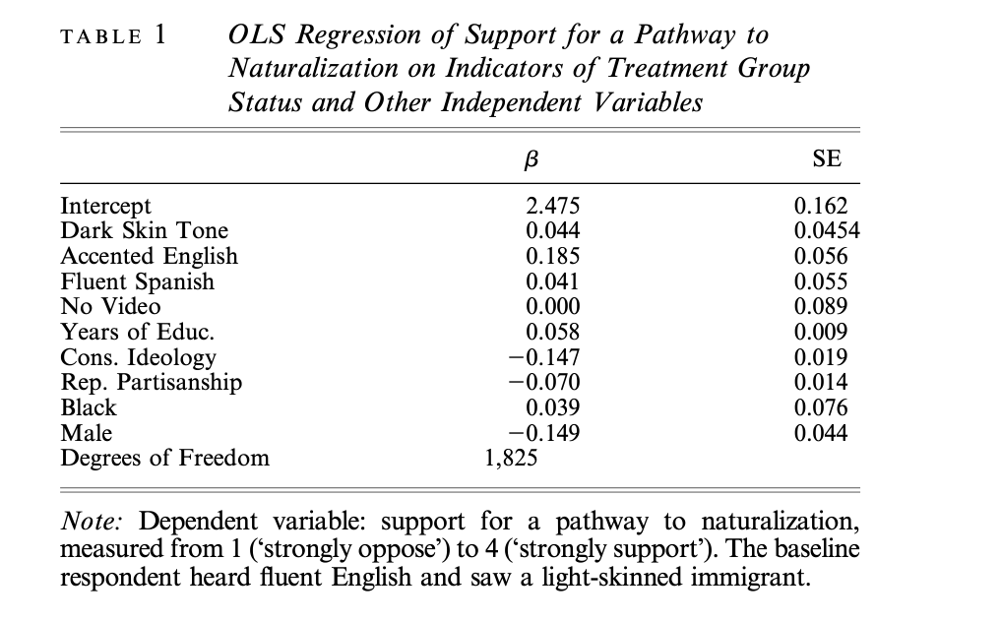

```{r setup, include=FALSE}
knitr::opts_chunk$set(echo = TRUE)

library(gt)
library(broom)
library(stargazer)
library(ggpubr)
library(sjPlot)
library(janitor)
library(rstanarm)
library(tidyverse)

# Read cleaned data from ./clean-data.

exp1_cleaned <- read_rds("clean-data/exp1_cleaned.rds") %>% 
  clean_names()
exp2_cleaned <- read_rds("clean-data/exp2_cleaned.rds") %>% 
  clean_names()
```

# Abstract

Hopkins (2015) finds that exposing a nationally representative sample of Americans to video of an immigrant speaking accented English causes the respondents to adopt more inclusionary attitudes. I successfully replicated Hopkins's results, except for a minor manipulation check and the composite immigration index. As an extension, I modified the original regression by adding respondents' self-reported familiarity with Spanish in real life. I found that respondents who reported more frequent encounters with Spanish tended to hold more restrictionist views. This result suggests the difficulty of changing exclusionary attitudes developed through long-term contact with culturally distinctive traits in daily life.

# Introduction

@hopkins tests prior hypotheses about natives' responses to culturally distinctive immigrants. Hopkins shows two nationally representative samples of non-Hispanic Americans video, adapted from an ABC news clip, of an undocumented Hispanic immigrant expressing support for assimilation and a path to citizenship. The video is edited such that the immigrant is visibly either dark- or light-skinned and speaks either fluent Spanish, fluent English, or heavily accented English. Afterwards, respondents are surveyed about a path to citizenship for undocumented immigrants, as well as other immigration-related questions. Hopkins runs OLS and logistic regressions on responses to these questions using indicators for treatment as well as conservatism, gender, and other respondent traits. Contrary to prior results like @blairetal suggesting the primacy of skin tone, Hopkins finds that skin tone does not meaningfully shift attitudes. Moreover, there is no difference between responses to fluent English or Spanish, but significantly more pro-immigrant responses to broken English. Hopkins theorizes that rather than heightening perceptions of cultural difference, a broken English speaker reinforces positive stereotypes about norms of hard work and assimilation.

I obtained data from Hopkins's webpage ^[Data and codebooks from @Hopkins may be found at http://web.sas.upenn.edu/danhop/research/]. All replication code was written in R^[@R] and may be found in my Github repo^[https://github.com/kevpwang/hopkins-replication].

# Literature Review

Previous literature develops several theories to predict and explain responses to culturally distinctive traits. The ethnocentrism-based approach, outlined in @kinderkam, holds that individuals are predisposed to divide society into in-groups and out-groups. On the other hand, other hypotheses, like @webercrocker, propound the primacy of skin-tone and argue that darker skin tone is determinative of more exclusionary attitudes.

# Replication

The replication is based on @king. I was able to replicate all but three charts and tables from @hopkins. I am not able to replicate Appendix A, Figure 1 because it is not entirely clear where that data is in the dataset and how to process it, but I anticipate coming up with a method soon. I can only partially replicate Figure 4 and Appendix C, Table 4 because the method for calculating the six-question index is not specified anywhere in the paper; I may have to email Hopkins and ask. The only additional aspect I am unable to replicate is the "free step-down resampling method" for generating the appropriate corrected p-values for Figure 3.

# Extension

In both the August 2010 and January 2011 surveys, all respondents were asked the following question: "In your day-to-day life, how frequently do you hear Spanish spoken? Never or almost never, less than once a month, 1-3 times each month, at least once a week, or every day?" I extend @hopkins by incorporating responses to this question in the regression models for immigration-related questions.

This "familiarity with Spanish" question could be reasonably expected to be an important explainer of immigration attitudes. In each survey, approximately 35 percent of respondents heard Spanish spoken every day, and about another 30 percent heard Spanish spoken at least once a week. Therefore, the apparent lack of exclusionary responses to "culturally distinctive" traits may be influenced by such widespread familiarity with Spanish among respondents, whereas other respondents less familiar with Spanish in their daily lives may exhibit more exclusionary responses for which the current analysis is not accounting. There is evidence for hostile responses to specifically *non-familiar* culturally distinctive traits in an experimental setting. For example, @enos finds that when Spanish speakers were introduced to a predominantly white, upper-income subway commute route, overall attitudes toward immigration become more exclusionary. It might similarly be the case in @hopkins that the only reason why fluent Spanish and broken English treatments do not prompt hostility is because the vast majority of respondents were already familiar with Spanish.

```{r Exp 1 extension, echo = FALSE}

ext1_q7 <- exp1_cleaned %>% 
  
  # Hopkins excludes Hispanics; sensible to exclude people who refused to answer Q7
  
  filter(ppethm != "Hispanic") %>% 
  filter(q7 != -1 & q14 != -1)

q7_model <- stan_glm(q7 ~ dark + accented + q14 + spanish + no_video + years_educ + conservative + republican + 
                       black + male, data = ext1_q7, refresh = 0)

ext1_q8 <- exp1_cleaned %>% 
  filter(ppethm != "Hispanic") %>% 
  filter(q8 != -1)

q8_model <- stan_glm(q8 ~ dark + accented + q14 + spanish + no_video + years_educ + conservative + republican + 
                       black + male, data = ext1_q8, refresh = 0)

ext1_q9 <- exp1_cleaned %>% 
  filter(ppethm != "Hispanic") %>% 
  filter(q9 != -1)

q9_model <- stan_glm(q9 ~ dark + accented + q14 + spanish + no_video + years_educ + conservative + republican + 
                       black + male, data = ext1_q9, refresh = 0)

ext1_q10 <- exp1_cleaned %>% 
  filter(ppethm != "Hispanic") %>% 
  filter(q10 != -1)

q10_model <- stan_glm(q10 ~ dark + accented + q14 + spanish + no_video + years_educ + conservative + republican + 
                       black + male, data = ext1_q10, refresh = 0)

ext1_q12a <- exp1_cleaned %>% 
  filter(ppethm != "Hispanic") %>% 
  drop_na(q12a) %>% 
  filter(q12a != -1)

q12a_model <- stan_glm(q12a ~ dark + accented + q14 + spanish + no_video + years_educ + conservative + republican + 
                       black + male, data = ext1_q12a, refresh = 0)

ext1_q13 <- exp1_cleaned %>% 
  filter(ppethm != "Hispanic") %>% 
  filter(q13 != -1)

q13_model <- stan_glm(q13 ~ dark + accented + q14 + spanish + no_video + years_educ + conservative + republican + 
                       black + male, data = ext1_q13, refresh = 0)
```

```{r Exp 1 ext graph, echo = FALSE}

# map() does not work here & nesting map() is probably not worth the
# trouble, especially since I'm not sure how to facet_wrap() geom_col()
# & give each graph its own separate title.

iv_list <- c("accented", "no_video", "q14")
parameters <- tibble(condition = c("Accent", "No Video", "Span. Familiar"),
       coef = map_dbl(iv_list, ~filter(tidy(q7_model), term == .x) %>% pull(estimate)),
       sd = map_dbl(iv_list, ~filter(tidy(q7_model), term == .x) %>% pull(std.error))
       ) %>%
  mutate(condition = factor(condition, levels = condition))

q7_plot <- ggplot(parameters, aes(x = condition, y = coef)) +
  geom_col(alpha = 0.5, color = "black") +
  geom_errorbar(aes(ymin = coef - sd, ymax = coef + sd), size = 1, width = 0) +
  geom_errorbar(aes(ymin = coef - 2 * sd, ymax = coef + 2 * sd), width = 0) +
  scale_y_continuous(limits = c(-0.4, 0.4)) +
  labs(
    title = "Support Pathway",
    x = "Treatment",
    y = "Difference from LS Fluent English"
    ) +
  theme(plot.title = element_text(size = 9),
        axis.title = element_text(size = 9),
        axis.text = element_text(size = 5)
        )

parameters <- tibble(condition = c("Accent", "No Video", "Span. Familiar"),
       coef = map_dbl(iv_list, ~filter(tidy(q8_model), term == .x) %>% pull(estimate)),
       sd = map_dbl(iv_list, ~filter(tidy(q8_model), term == .x) %>% pull(std.error))
       ) %>% 
  mutate(condition = factor(condition, levels = condition))

q8_plot <- ggplot(parameters, aes(x = condition, y = coef)) +
  geom_col(alpha = 0.5, color = "black") +
  geom_errorbar(aes(ymin = coef - sd, ymax = coef + sd), size = 1, width = 0) +
  geom_errorbar(aes(ymin = coef - 2 * sd, ymax = coef + 2 * sd), width = 0) +
  scale_y_continuous(limits = c(-0.4, 0.4)) +
  labs(
    title = "Support Increased Immigration",
    x = "Treatment",
    y = "Difference from LS Fluent English"
    ) +
  theme(plot.title = element_text(size = 9),
        axis.title = element_text(size = 9),
        axis.text = element_text(size = 5)
        )

parameters <- tibble(condition = c("Accent", "No Video", "Span. Familiar"),
       coef = map_dbl(iv_list, ~filter(tidy(q9_model), term == .x) %>% pull(estimate)),
       sd = map_dbl(iv_list, ~filter(tidy(q9_model), term == .x) %>% pull(std.error))
       ) %>% 
  mutate(condition = factor(condition, levels = condition))

q9_plot <- ggplot(parameters, aes(x = condition, y = coef)) +
  geom_col(alpha = 0.5, color = "black") +
  geom_errorbar(aes(ymin = coef - sd, ymax = coef + sd), size = 1, width = 0) +
  geom_errorbar(aes(ymin = coef - 2 * sd, ymax = coef + 2 * sd), width = 0) +
  scale_y_continuous(limits = c(-0.4, 0.3), breaks = c(-0.4, -0.2, 0.1, 0.2, 0.3)) +
  labs(
    title = "Don't Feel Threatened",
    x = "Treatment",
    y = "Difference from LS Fluent English"
    ) +
  theme(plot.title = element_text(size = 9),
        axis.title = element_text(size = 9),
        axis.text = element_text(size = 5)
        )

parameters <- tibble(condition = c("Accent", "No Video", "Span. Familiar"),
       coef = map_dbl(iv_list, ~filter(tidy(q10_model), term == .x) %>% pull(estimate)),
       sd = map_dbl(iv_list, ~filter(tidy(q10_model), term == .x) %>% pull(std.error))
       ) %>% 
  mutate(condition = factor(condition, levels = condition))

q10_plot <- ggplot(parameters, aes(x = condition, y = coef)) +
  geom_col(alpha = 0.5, color = "black") +
  geom_errorbar(aes(ymin = coef - sd, ymax = coef + sd), size = 1, width = 0) +
  geom_errorbar(aes(ymin = coef - 2 * sd, ymax = coef + 2 * sd), width = 0) +
  scale_y_continuous(limits = c(-0.3, 0.3), breaks = c(-0.3, -0.1, 0.1, 0.3)) +
  labs(
    title = "Strengthen American Society",
    x = "Treatment",
    y = "Difference from LS Fluent English"
    ) +
  theme(plot.title = element_text(size = 9),
        axis.title = element_text(size = 9),
        axis.text = element_text(size = 5)
        )

parameters <- tibble(condition = c("Accent", "No Video", "Span. Familiar"),
       coef = map_dbl(iv_list, ~filter(tidy(q12a_model), term == .x) %>% pull(estimate)),
       sd = map_dbl(iv_list, ~filter(tidy(q12a_model), term == .x) %>% pull(std.error))
       ) %>% 
  mutate(condition = factor(condition, levels = condition))

q12a_plot <- ggplot(parameters, aes(x = condition, y = coef)) +
  geom_col(alpha = 0.5, color = "black") +
  geom_errorbar(aes(ymin = coef - sd, ymax = coef + sd), size = 1, width = 0) +
  geom_errorbar(aes(ymin = coef - 2 * sd, ymax = coef + 2 * sd), width = 0) +
  scale_y_continuous(limits = c(-0.3, 0.3), breaks = c(-0.3, -0.1, 0.1, 0.3)) +
  labs(
    title = "Social Trust",
    x = "Treatment",
    y = "Difference from LS Fluent English"
    ) +
  theme(plot.title = element_text(size = 9),
        axis.title = element_text(size = 9),
        axis.text = element_text(size = 5)
        )

parameters <- tibble(condition = c("Accent", "No Video", "Span. Familiar"),
       coef = map_dbl(iv_list, ~filter(tidy(q13_model), term == .x) %>% pull(estimate)),
       sd = map_dbl(iv_list, ~filter(tidy(q13_model), term == .x) %>% pull(std.error))
       ) %>% 
  mutate(condition = factor(condition, levels = condition))

q13_plot <- ggplot(parameters, aes(x = condition, y = coef)) +
  geom_col(alpha = 0.5, color = "black") +
  geom_errorbar(aes(ymin = coef - sd, ymax = coef + sd), size = 1, width = 0) +
  geom_errorbar(aes(ymin = coef - 2 * sd, ymax = coef + 2 * sd), width = 0) +
  scale_y_continuous(limits = c(-0.3, 0.3), breaks = c(-0.3, -0.1, 0.1, 0.3)) +
  labs(
    title = "Don't Take Jobs",
    x = "Treatment",
    y = "Difference from LS Fluent English"
    ) +
  theme(plot.title = element_text(size = 9),
        axis.title = element_text(size = 9),
        axis.text = element_text(size = 5)
        )

ggarrange(q7_plot, q12a_plot, q9_plot, q10_plot, q13_plot, q8_plot,
                   ncol = 3, nrow = 2)
```

I modified the regressions on all six original questions from @hopkins to include familiarity with Spanish. The question is coded on a numerical scale from 1 to 5 with 5 as hearing Spanish "every day". The results of the analysis are surprising and run counter to expectations. Since @hopkins finds that responses to the "increased legal immigration" question are correlated differently than the other questions, we will set aside that question as similarly anomalous. As the figure above shows, on all four remaining immigration-related questions, the effect of familarity with Spanish is exactly opposite that of accented English. Respondents who are more familiar with Spanish in daily life tend to record more exclusionary responses. For most questions, the familiarity coefficient is significantly smaller than the coefficient of accented English, but the associated uncertainty is also significantly smaller, indicating that the effect is likely to be consistent.

This extension of the model does not necessarily change the fundamental conclusions of @hopkins. The chief finding, that accented English elicits inclusionary rather than exclusionary responses, remains valid and the effect is unchanged by the new model. Rather, the extension raises questions about the preconditions that would cause positive or negative reactions in response to "culturally distinctive" traits. Contrary to @enos, the data from @hopkins suggest that lack of familiarity does not necessarily result in hostility, nor does prolonged familiarity abate hostility. Further inquiry is needed on the effects of long-term exposure to cultural diversity.

# (APPENDIX) Appendix {-} 

# Appendix

## Replication of Table 1, @hopkins 



```{r Tab 1 repl, echo = FALSE, results = "asis"}
# Regression analysis for Q7 path to citizenship
# Hopkins excludes Hispanics; sensible to exclude 'refused'

exp1_q7 <- exp1_cleaned %>% 
  filter(ppethm != "Hispanic") %>% 
  filter(q7 != -1)

q7_model <- lm(q7 ~ dark + accented + spanish + no_video + years_educ + conservative + republican + 
                 black + male, data = exp1_q7)

# Reg table with stargazer 
# header = FALSE to get rid of stargazer tag

stargazer(q7_model,
          title = "OLS Regression of Support for a Pathway to Naturalization on Indicators of Treatment
          Group Status and Other Independent Variables",
          digits = 3,
          header = FALSE)
```

```{r Fig 2 repl, echo = FALSE, include = FALSE, eval = FALSE}

# Pull coefs from regression

iv_list <- c("accented", "spanish", "no_video")
parameters <- tibble(condition = c("Accented English", "Fluent Spanish", "No Video (Control)"),
                     coef = map_dbl(iv_list, ~filter(tidy(q7_model), term == .x) %>% pull(estimate)),
                     sd = map_dbl(iv_list, ~filter(tidy(q7_model), term == .x) %>% pull(std.error))
)

# Plot effects for relevant groups
# 68% & 95% confints with geom_errorbar()

ggplot(parameters, aes(x = condition, y = coef)) +
  geom_col(alpha = 0.5, color = "black") +
  geom_errorbar(aes(ymin = coef - sd, ymax = coef + sd), size = 1, width = 0) +
  geom_errorbar(aes(ymin = coef - 2 * sd, ymax = coef + 2 * sd), width = 0) +
  scale_y_continuous(limits = c(-0.4, 0.4)) +
  labs(
    title = "Support Pathway to Naturalization",
    subtitle = "Subjects who heard broken English display significantly more pro-immigrant attitudes",
    x = "Treatment",
    y = "Difference from Fluent English"
  )
```

```{r Fig 3 repl, echo = FALSE, include = FALSE, eval = FALSE}

# Six models: 7, 8 (legal imm), 9 (generic threat), 10 (strengthens), 12a (trust),
# 13 (job threat).
# Separately filter for 'refused' for each Q.

exp1_q8 <- exp1_cleaned %>% 
  filter(ppethm != "Hispanic") %>% 
  filter(q8 != -1)
q8_model <- lm(q8 ~ dark + accented + spanish + no_video + years_educ + conservative + republican + 
                       black + male, data = exp1_q8)

exp1_q9 <- exp1_cleaned %>% 
  filter(ppethm != "Hispanic") %>% 
  filter(q9 != -1)
q9_model <- lm(q9 ~ dark + accented + spanish + no_video + years_educ + conservative + republican + 
                       black + male, data = exp1_q9)

exp1_q10 <- exp1_cleaned %>% 
  filter(ppethm != "Hispanic") %>% 
  filter(q10 != -1)
q10_model <- lm(q10 ~ dark + accented + spanish + no_video + years_educ + conservative + republican + 
                        black + male, data = exp1_q10)

# Supposed to be logistic (in Appendix), but coefs in Fig 3 are from linreg

exp1_q12a <- exp1_cleaned %>% 
  filter(ppethm != "Hispanic") %>% 
  drop_na(q12a) %>% 
  filter(q12a != -1)
q12a_model <- lm(q12a ~ dark + accented + spanish + no_video + years_educ + conservative + republican + 
                         black + male, data = exp1_q12a)

exp1_q13 <- exp1_cleaned %>% 
  filter(ppethm != "Hispanic") %>% 
  filter(q13 != -1)
q13_model <- lm(q13 ~ dark + accented + spanish + no_video + years_educ + conservative + republican + 
                        black + male, data = exp1_q13)

# Make each graph & combine with ggarrange()
# Same procedure as Fig 2

iv_list <- c("accented", "spanish", "no_video", "dark")
parameters <- tibble(condition = c("Accent", "Span.", "No Video", "Dark"),
                     coef = map_dbl(iv_list, ~filter(tidy(q7_model), term == .x) %>% pull(estimate)),
                     sd = map_dbl(iv_list, ~filter(tidy(q7_model), term == .x) %>% pull(std.error))
                     ) %>%
  mutate(condition = factor(condition, levels = condition))

q7_plot <- ggplot(parameters, aes(x = condition, y = coef)) +
  geom_col(alpha = 0.5, color = "black") +
  geom_errorbar(aes(ymin = coef - sd, ymax = coef + sd), size = 1, width = 0) +
  geom_errorbar(aes(ymin = coef - 2 * sd, ymax = coef + 2 * sd), width = 0) +
  scale_y_continuous(limits = c(-0.4, 0.4)) +
  labs(
    title = "Support Pathway",
    x = "Treatment",
    y = "Difference from LS Fluent English"
  ) +
  theme(plot.title = element_text(size = 9),
        axis.title = element_text(size = 9),
        axis.text = element_text(size = 5)
        )

parameters <- tibble(condition = c("Accent", "Span.", "No Video", "Dark"),
                     coef = map_dbl(iv_list, ~filter(tidy(q8_model), term == .x) %>% pull(estimate)),
                     sd = map_dbl(iv_list, ~filter(tidy(q8_model), term == .x) %>% pull(std.error))
                     ) %>% 
  mutate(condition = factor(condition, levels = condition))

q8_plot <- ggplot(parameters, aes(x = condition, y = coef)) +
  geom_col(alpha = 0.5, color = "black") +
  geom_errorbar(aes(ymin = coef - sd, ymax = coef + sd), size = 1, width = 0) +
  geom_errorbar(aes(ymin = coef - 2 * sd, ymax = coef + 2 * sd), width = 0) +
  scale_y_continuous(limits = c(-0.4, 0.4)) +
  labs(
    title = "Support Increased Immigration",
    x = "Treatment",
    y = "Difference from LS Fluent English"
    ) +
  theme(plot.title = element_text(size = 9),
        axis.title = element_text(size = 9),
        axis.text = element_text(size = 5)
        )

parameters <- tibble(condition = c("Accent", "Span.", "No Video", "Dark"),
                     coef = map_dbl(iv_list, ~filter(tidy(q9_model), term == .x) %>% pull(estimate)),
                     sd = map_dbl(iv_list, ~filter(tidy(q9_model), term == .x) %>% pull(std.error))
                     ) %>% 
  mutate(condition = factor(condition, levels = condition))

q9_plot <- ggplot(parameters, aes(x = condition, y = coef)) +
  geom_col(alpha = 0.5, color = "black") +
  geom_errorbar(aes(ymin = coef - sd, ymax = coef + sd), size = 1, width = 0) +
  geom_errorbar(aes(ymin = coef - 2 * sd, ymax = coef + 2 * sd), width = 0) +
  scale_y_continuous(limits = c(-0.4, 0.3), breaks = c(-0.4, -0.2, 0.1, 0.2, 0.3)) +
  labs(
    title = "Don't Feel Threatened",
    x = "Treatment",
    y = "Difference from LS Fluent English"
    ) +
  theme(plot.title = element_text(size = 9),
        axis.title = element_text(size = 9),
        axis.text = element_text(size = 5)
        )

parameters <- tibble(condition = c("Accent", "Span.", "No Video", "Dark"),
                     coef = map_dbl(iv_list, ~filter(tidy(q10_model), term == .x) %>% pull(estimate)),
                     sd = map_dbl(iv_list, ~filter(tidy(q10_model), term == .x) %>% pull(std.error))
                     ) %>% 
  mutate(condition = factor(condition, levels = condition))

q10_plot <- ggplot(parameters, aes(x = condition, y = coef)) +
  geom_col(alpha = 0.5, color = "black") +
  geom_errorbar(aes(ymin = coef - sd, ymax = coef + sd), size = 1, width = 0) +
  geom_errorbar(aes(ymin = coef - 2 * sd, ymax = coef + 2 * sd), width = 0) +
  scale_y_continuous(limits = c(-0.3, 0.3), breaks = c(-0.3, -0.1, 0.1, 0.3)) +
  labs(
    title = "Strengthen American Society",
    x = "Treatment",
    y = "Difference from LS Fluent English"
    ) +
  theme(plot.title = element_text(size = 9),
        axis.title = element_text(size = 9),
        axis.text = element_text(size = 5)
        )

parameters <- tibble(condition = c("Accent", "Span.", "No Video", "Dark"),
                     coef = map_dbl(iv_list, ~filter(tidy(q12a_model), term == .x) %>% pull(estimate)),
                     sd = map_dbl(iv_list, ~filter(tidy(q12a_model), term == .x) %>% pull(std.error))
                     ) %>% 
  mutate(condition = factor(condition, levels = condition))

q12a_plot <- ggplot(parameters, aes(x = condition, y = coef)) +
  geom_col(alpha = 0.5, color = "black") +
  geom_errorbar(aes(ymin = coef - sd, ymax = coef + sd), size = 1, width = 0) +
  geom_errorbar(aes(ymin = coef - 2 * sd, ymax = coef + 2 * sd), width = 0) +
  scale_y_continuous(limits = c(-0.3, 0.3), breaks = c(-0.3, -0.1, 0.1, 0.3)) +
  labs(
    title = "Social Trust",
    x = "Treatment",
    y = "Difference from LS Fluent English"
    ) +
  theme(plot.title = element_text(size = 9),
        axis.title = element_text(size = 9),
        axis.text = element_text(size = 5)
        )

parameters <- tibble(condition = c("Accent", "Span.", "No Video", "Dark"),
                     coef = map_dbl(iv_list, ~filter(tidy(q13_model), term == .x) %>% pull(estimate)),
                     sd = map_dbl(iv_list, ~filter(tidy(q13_model), term == .x) %>% pull(std.error))
                     ) %>% 
  mutate(condition = factor(condition, levels = condition))

q13_plot <- ggplot(parameters, aes(x = condition, y = coef)) +
  geom_col(alpha = 0.5, color = "black") +
  geom_errorbar(aes(ymin = coef - sd, ymax = coef + sd), size = 1, width = 0) +
  geom_errorbar(aes(ymin = coef - 2 * sd, ymax = coef + 2 * sd), width = 0) +
  scale_y_continuous(limits = c(-0.3, 0.3), breaks = c(-0.3, -0.1, 0.1, 0.3)) +
  labs(
    title = "Don't Take Jobs",
    x = "Treatment",
    y = "Difference from LS Fluent English"
    ) +
  theme(plot.title = element_text(size = 9),
        axis.title = element_text(size = 9),
        axis.text = element_text(size = 5)
        )

ggarrange(q7_plot, q12a_plot, q9_plot, q10_plot, q13_plot, q8_plot,
          ncol = 3, nrow = 2)
```

```{r Fig 4 repl, echo = FALSE, include = FALSE, eval = FALSE}

# Data from second survey, same path to citizenship question
# Could not replicate index of 6 Qs bc. no method specified for creating index

exp2_q7 <- exp2_cleaned %>% 
  filter(ppethm != "Hispanic") %>% 
  filter(q7 != -1)

q7_model <- lm(q7 ~ accented + spanish + years_educ + conservative + democratic + 
                       male + black, data = exp2_q7)

# Same procedure as previous

iv_list <- c("accented", '(Intercept)', "spanish")
parameters <- tibble(condition = c("Accent", "English", "Spanish"),
                     coef = map_dbl(iv_list, ~filter(tidy(q7_model), term == .x) %>% pull(estimate)),
                     sd = map_dbl(iv_list, ~filter(tidy(q7_model), term == .x) %>% pull(std.error))
) %>% 
  mutate(condition = factor(condition, levels = condition))

# Set English coef to 0 bc. it is baseline

parameters[2,2] <- 0

ggplot(parameters, aes(x = condition, y = coef)) +
  geom_col(alpha = 0.5, color = "black") +
  geom_errorbar(aes(ymin = coef - sd, ymax = coef + sd), size = 1, width = 0) +
  geom_errorbar(aes(ymin = coef - 2 * sd, ymax = coef + 2 * sd), width = 0) +
  scale_y_continuous(limits = c(-0.2, 0.3), breaks = c(-0.2, -0.1, 0.1, 0.2, 0.3)) +
  labs(
    title = "Support Pathway",
    subtitle = paste("mean = ", round(mean(exp2_q7$q7), 1), 
                     ", SD = ", round(sd(exp2_q7$q7), 1), sep = ""),
    x = "Treatment",
    y = "Difference from control (English)"
  )
```

```{r App C Tab 1 repl, echo = FALSE, include = FALSE, eval = FALSE}

# Summary statistics table

exp1_tab1 <- exp1_cleaned %>% 
  filter(ppethm != "Hispanic") %>% 
  select(income, years_educ, online, employed, conservative,
         republican, black, other, ppage)

exp2_tab1 <- exp2_cleaned %>% 
  filter(ppethm != "Hispanic") %>% 
  select(income, years_educ, online, employed, conservative,
         republican, black, other, ppage)

table <- tibble(labels = c("Income", "Years of Education", "Online", "Employed",
                           "Conservative", "Republica", "Black", "Other", "Age"),
                mean1 = colMeans(exp1_tab1),
                sd1 = apply(exp1_tab1, 2, sd),
                min1 = apply(exp1_tab1, 2, min),
                max1 = apply(exp1_tab1, 2, max),
                mean2 = colMeans(exp2_tab1),
                sd2 = apply(exp2_tab1, 2, sd),
                min2 = apply(exp2_tab1, 2, min),
                max2 = apply(exp2_tab1, 2, max)
)
table %>% 
  gt() %>% 
  tab_spanner(
    label = "August 2010 Experiment",
    columns = vars(mean1, sd1, min1, max1)
  ) %>% 
  tab_spanner(
    label = "January 2011 Experiment",
    columns = vars(mean2, sd2, min2, max2)
  ) %>% 
  fmt_number(
    decimals = 2,
    columns = vars(mean1, sd1, min1, max1, 
                   mean2, sd2, min2, max2)
  ) %>% 
  cols_label(
    labels = "",
    mean1 = "Mean",
    sd1 = "SD",
    min1 = "Min.",
    max1 = "Max.",
    mean2 = "Mean",
    sd2 = "SD",
    min2 = "Min.",
    max2 = "Max.",
  )
```

```{r App C Tab 2 repl, echo = FALSE, include = FALSE, eval = FALSE}

# Regression table for Q7, 8, 9 using IVs in App C Table 2.

q7_model <- lm(q7 ~ dark + accented + spanish + no_video + years_educ + conservative + republican + 
                 black + male, data = exp1_q7)

tab_model(q7_model, q8_model, q9_model,
          show.se = TRUE,
          show.ci = FALSE,
          show.r2 = FALSE,
          digits = 3,
          dv.labels = c("Pathway", "Legal Immig.", "Generic Threat"),
          pred.labels = c("Intercept", "Accented", "English", "Spanish", "Dark Skin",
                          "Education", "Conservative Ideo.", "Republican ID",
                          "Black", "Male"))
```

```{r App C Tab 3 repl, echo = FALSE, include = FALSE, eval = FALSE}

# Regression table for Q10, 12a, 13
# Q12a model in table is logistic, but coefs in Fig 3 are linreg

q12a_model <- glm(q12a ~ accented + english + spanish + dark + years_educ + conservative + republican + 
                         black + male, family = "binomial", data = exp1_q12a)

tab_model(q10_model, q12a_model, q13_model,
          show.se = TRUE,
          show.ci = FALSE,
          show.r2 = FALSE,
          transform = NULL,
          digits = 3,
          dv.labels = c("Strengthen America", "Social Trust", "Job Threat"),
          pred.labels = c("Intercept", "Accented", "English", "Spanish", "Dark Skin",
                          "Education", "Conservative Ideo.", "Republican ID",
                          "Black", "Male"))
```

```{r App C Tab 4 repl, echo = FALSE, include = FALSE, eval = FALSE}
q7_model <- lm(q7 ~ accented + spanish + years_educ + conservative + democratic + 
                       male + black, data = exp2_q7)

tab_model(q7_model,
          show.se = TRUE,
          show.ci = FALSE,
          show.r2 = FALSE,
          digits = 3,
          dv.labels = "Pathway",
          pred.labels = c("Intercept", "Accented", "Spanish", "Education", "Conservative Ideo.", 
                          "Democratic ID", "Male", "Black"))
```

# References