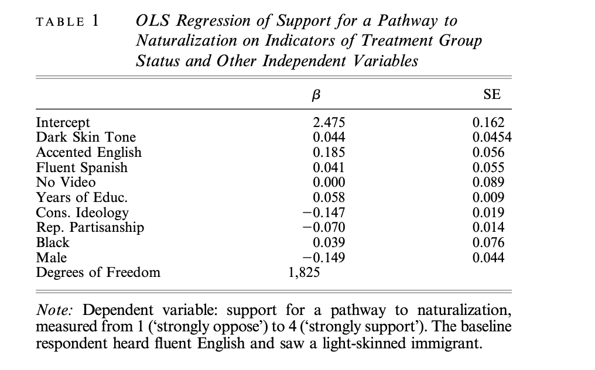

```{r setup, include=FALSE}
knitr::opts_chunk$set(echo = TRUE, cache = TRUE, cache.lazy = FALSE, fig.pos = "H")

library(gt)
library(broom)
library(stargazer)
library(ggpubr)
library(sjPlot)
library(kableExtra)
library(janitor)
library(rstanarm)
library(tidyverse)

# Read cleaned data from ./clean-data.

exp1_cleaned <- read_rds("clean-data/exp1_cleaned.rds") %>% 
  clean_names() %>% 
  
  # Hopkins excludes Hispanics; recode all refusals to NA to
  # exclude from regressions.
  
  filter(ppethm != "Hispanic") %>% 
  na_if(-1)

exp2_cleaned <- read_rds("clean-data/exp2_cleaned.rds") %>% 
  clean_names() %>% 
  filter(ppethm != "Hispanic") %>%
  na_if(-1)
```

# Abstract

@hopkins finds that exposing a representative sample of Americans to video of an immigrant speaking accented English prompts respondents to adopt more inclusionary attitudes. I successfully replicated Hopkins's results, except for minor manipulation and robustness checks and the composite immigration index, which do not substantially affect his conclusions. As an extension, I included respondents' self-reported frequency of contact with Spanish in Hopkins's regression models and tested for heterogeneous effects of accented English among subgroups defined by level of Spanish familiarity. I found that while preexisting familiarity with Spanish is associated with more exclusionary baseline attitudes, there are no significant subgroup differences in the treatment effect of accented English. This suggests the difficulty of changing exclusionary attitudes developed through long-term encounters with culturally distinctive traits in real life.

# Introduction

@hopkins tests prior hypotheses about natives' responses to culturally distinctive immigrants through two surveys conducted in August 2010 and January 2011. In both, he shows two nationally representative samples of non-Hispanic Americans video, adapted from an ABC news clip, of an undocumented Hispanic immigrant expressing support for assimilation and a path to citizenship. The video is edited such that the immigrant is either visibly dark- or light-skinned and speaks either fluent Spanish, fluent English, or heavily accented English. Afterwards, respondents are surveyed about a path to citizenship for undocumented immigrants and five other immigration-related questions. Hopkins runs OLS and logistic regressions on these attitudes using video treatment indicators as well as conservatism, gender, and other respondent traits. Contrary to prior results like @blairetal suggesting the primacy of skin tone, Hopkins finds that skin tone does not meaningfully shift attitudes. Moreover, there is no difference between responses to fluent English or Spanish, but significantly more pro-immigrant responses to broken English. Hopkins theorizes that rather than heightening perceptions of cultural difference, a broken English speaker reinforces positive stereotypes about norms of hard work and assimilation.

I obtained data from Hopkins's webpage ^[Data and codebooks from @hopkins may be found at http://web.sas.upenn.edu/danhop/research/]. All replication code was written in R^[@R] and may be found in my Github repo^[https://github.com/kevpwang/hopkins-replication].

I successfully replicated all of Hopkins's results with three exceptions. First, I did not replicate a manipulation check that asked respondents to guess the immigrant's likely country of origin, thus establishing that respondents perceived the treatment in a sensible way. Second, for reasons of technical knowledge, I was unable to replicate the free step-down resampling method for generating corrected p-values for regression parameters. Third, I was unable to replicate a composite index of six immigration-related questions because the index creation methodology was not specified. None of these significantly affect Hopkins's substantive conclusions.

Hopkins's surveys include a question which asks respondents to report their familiarity with Spanish in daily life. Given that the majority of respondents reported hearing Spanish at least once a week, I modified the regression models on immigration-related questions to include responses to this "familiarity" question as an indicator. I also tested for heterogeneous effects in Hopkins's existing models by estimating the treatment effect of accented English for subgroups, as defined by level of familiarity with Spanish. I find that greater preexisting familiarity with Spanish is associated with more exclusionary baseline attitudes. I find no significant subgroup differences in the effect of accented English. While not contradicting Hopkins's findings about the upside of accented English, this extension suggests that long-term contact with culturally distinctive traits outside of the experimental setting may engender exclusionary attitudes which are more deep-seated and difficult to counteract.

# Literature Review

Prior literature develops several theories to predict and explain responses to culturally distinctive traits. The ethnocentrism-based approach^[@kinderkam] postulates that individuals are predisposed to divide society into in-groups and out-groups. What distinguishes ethnocentrism from mere prejudice is indiscriminatory hostility by the in-group toward all out-groups, rather than specific hostility directed at one particular out-group based on particular group characteristics. @snidermanetal find that native Italians hold similar attitudes toward both African and Eastern European immigrants. The implication of ethnocentrism is what @hopkins terms the "interchangeable out-group hypothesis". Under this hypothesis, characteristics like speaking a foreign language consistently elicit opposition by conspicuously marking an individual as a member of an out-group.

Extending the interchangeable out-group hypothesis, some studies contend that darker skin tone in particular drives exclusionary attitudes. For instance, @blairetal show that individuals, even when they can identify Afrocentric facial features and are aware of their own cognitive process, cannot avoid using such features to reinforce racial biases.

On the other hand, other studies postulate that exclusionary attitudes only arise in response to culturally distinctive traits that specifically reinforce preexisting negative stereotypes. @gilens finds that non-black Americans are not automatically hostile towards black Americans, but respond negatively to the extent that African-Americans are perceived to violate traditional norms of hard work. This leads to what @hopkins terms the "upside of accents hypothesis", in which responses to a culturally distinctive trait are highly dependent on the content and context of that trait.

# Replication

I successfully replicated all but three of Hopkins's results. First, I did not replicate a manipulation check that asked respondents to guess the immigrant's likely country of origin in order to establish that respondents perceived the treatment in a sensible way. Second, for technical reasons, I was unable to replicate the free step-down resampling method for generating corrected p-values for regression parameters. Third, I was unable to replicate a composite index of six immigration-related questions because @hopkins did not specify the method by which the index was created. None of these significantly affect Hopkins's substantive conclusions.

# Extension

In both the August 2010 and January 2011 surveys, all respondents were asked the following question: "In your day-to-day life, how frequently do you hear Spanish spoken? Never or almost never, less than once a month, 1-3 times each month, at least once a week, or every day?" I extend @hopkins in two ways using this "familiarity" question. I incorporated familiarity with Spanish as an indicator in Hopkins's regression models for immigration attitudes. I also tested for heterogeneous effects of accented English among subgroups defined by level of familiarity with Spanish.

```{r Exp 1 ext models, echo = FALSE}

q7_model <- lm(q7 ~ dark + accented + span_contact + spanish + no_video + years_educ + conservative + republican + 
                       black + male, data = exp1_cleaned)

q8_model <- lm(q8 ~ dark + accented + span_contact + spanish + no_video + years_educ + conservative + republican + 
                       black + male, data = exp1_cleaned)

q9_model <- lm(q9 ~ dark + accented + span_contact + spanish + no_video + years_educ + conservative + republican + 
                       black + male, data = exp1_cleaned)

q10_model <- lm(q10 ~ dark + accented + span_contact + spanish + no_video + years_educ + conservative + republican + 
                       black + male, data = exp1_cleaned)

q12a_model <- lm(q12a ~ dark + accented + span_contact + spanish + no_video + years_educ + conservative + republican + 
                       black + male, data = exp1_cleaned)

q13_model <- lm(q13 ~ dark + accented + span_contact + spanish + no_video + years_educ + conservative + republican + 
                       black + male, data = exp1_cleaned)
```

```{r Exp 1 Q7 ext, echo = FALSE, results = "asis"}
stargazer(q7_model,
          title = "OLS Regression of Support for a Pathway to Naturalization, Including Respondent Familiarity with
          Spanish",
          digits = 3,
          header = FALSE,
          table.placement = "H",
          no.space = TRUE,
          single.row = TRUE,
          omit.stat = c("f", "ser", "rsq", "adj.rsq"),
          notes = c('Dependent variable: support for a pathway to citizenship measured from', 
                    '1 ("strongly oppose") to 4 ("strongly support"). Baseline respondent heard', 
                    'fluent English and saw a light-skinned immigrant.'),
          notes.align = "l"
          )
```

Table 1 presents my extended regression model for attitudes about the path to citizenship. The citizenship question is measured on a numerical scale from 1 ("strongly oppose") to 4 ("strongly support"). Self-reported familiarity with Spanish, represented by the `span_contact` term in the table, is similarly treated as a continuous variable, measured from 1 ("never or almost never" hear Spanish) to 5 (hear Spanish "every day"). As the table shows, greater prexexisting familiarity with Spanish in real life, similar to conservatism and Republican partisanship, is associated with a more exclusionary attitude. With a 95 percent confidence interval of approximately -0.08 to -0.06, we can be fairly certain of the negative direction of this effect. Given that the majority of respondents reported a familiarity of at least 4 (hear Spanish "at least once a week"), the magnitude of the estimated familiarity effect more than outweighs the accented English effect.

```{r echo = FALSE, fig.cap = 'August 2010 survey. Extended models for various immigration attitudes. The grey bars illustrate the estimated effect of each treatment compared to a respondent who saw a light-skinned immigrant speaking fluent English. Thick and thin vertical lines represent one and two standard deviations above and below the mean. All questions are measured on a numerical scale, with a higher number being less exclusionary.'}

# map() does not work here & nesting map() is probably not worth the
# trouble, especially since I'm not sure how to facet_wrap() geom_col()
# & give each graph its own separate title.

iv_list <- c("accented", "no_video", "span_contact")
parameters <- tibble(condition = c("Accent", "No Video", "Span. Familiar"),
       coef = map_dbl(iv_list, ~filter(tidy(q7_model), term == .x) %>% pull(estimate)),
       sd = map_dbl(iv_list, ~filter(tidy(q7_model), term == .x) %>% pull(std.error))
       ) %>%
  mutate(condition = factor(condition, levels = condition))

q7_plot <- ggplot(parameters, aes(x = condition, y = coef)) +
  geom_col(alpha = 0.5, color = "black") +
  geom_errorbar(aes(ymin = coef - sd, ymax = coef + sd), size = 1, width = 0) +
  geom_errorbar(aes(ymin = coef - 2 * sd, ymax = coef + 2 * sd), width = 0) +
  scale_y_continuous(limits = c(-0.4, 0.4)) +
  labs(
    title = "Support Pathway",
    x = "Treatment",
    y = "Difference from LS Fluent English"
    ) +
  theme(plot.title = element_text(size = 9),
        axis.title = element_text(size = 9),
        axis.text = element_text(size = 5)
        )

parameters <- tibble(condition = c("Accent", "No Video", "Span. Familiar"),
       coef = map_dbl(iv_list, ~filter(tidy(q8_model), term == .x) %>% pull(estimate)),
       sd = map_dbl(iv_list, ~filter(tidy(q8_model), term == .x) %>% pull(std.error))
       ) %>% 
  mutate(condition = factor(condition, levels = condition))

q8_plot <- ggplot(parameters, aes(x = condition, y = coef)) +
  geom_col(alpha = 0.5, color = "black") +
  geom_errorbar(aes(ymin = coef - sd, ymax = coef + sd), size = 1, width = 0) +
  geom_errorbar(aes(ymin = coef - 2 * sd, ymax = coef + 2 * sd), width = 0) +
  scale_y_continuous(limits = c(-0.4, 0.4)) +
  labs(
    title = "Support Increased Immigration",
    x = "Treatment",
    y = "Difference from LS Fluent English"
    ) +
  theme(plot.title = element_text(size = 9),
        axis.title = element_text(size = 9),
        axis.text = element_text(size = 5)
        )

parameters <- tibble(condition = c("Accent", "No Video", "Span. Familiar"),
       coef = map_dbl(iv_list, ~filter(tidy(q9_model), term == .x) %>% pull(estimate)),
       sd = map_dbl(iv_list, ~filter(tidy(q9_model), term == .x) %>% pull(std.error))
       ) %>% 
  mutate(condition = factor(condition, levels = condition))

q9_plot <- ggplot(parameters, aes(x = condition, y = coef)) +
  geom_col(alpha = 0.5, color = "black") +
  geom_errorbar(aes(ymin = coef - sd, ymax = coef + sd), size = 1, width = 0) +
  geom_errorbar(aes(ymin = coef - 2 * sd, ymax = coef + 2 * sd), width = 0) +
  scale_y_continuous(limits = c(-0.4, 0.3), breaks = c(-0.4, -0.2, 0.1, 0.2, 0.3)) +
  labs(
    title = "Don't Feel Threatened",
    x = "Treatment",
    y = "Difference from LS Fluent English"
    ) +
  theme(plot.title = element_text(size = 9),
        axis.title = element_text(size = 9),
        axis.text = element_text(size = 5)
        )

parameters <- tibble(condition = c("Accent", "No Video", "Span. Familiar"),
       coef = map_dbl(iv_list, ~filter(tidy(q10_model), term == .x) %>% pull(estimate)),
       sd = map_dbl(iv_list, ~filter(tidy(q10_model), term == .x) %>% pull(std.error))
       ) %>% 
  mutate(condition = factor(condition, levels = condition))

q10_plot <- ggplot(parameters, aes(x = condition, y = coef)) +
  geom_col(alpha = 0.5, color = "black") +
  geom_errorbar(aes(ymin = coef - sd, ymax = coef + sd), size = 1, width = 0) +
  geom_errorbar(aes(ymin = coef - 2 * sd, ymax = coef + 2 * sd), width = 0) +
  scale_y_continuous(limits = c(-0.3, 0.3), breaks = c(-0.3, -0.1, 0.1, 0.3)) +
  labs(
    title = "Strengthen American Society",
    x = "Treatment",
    y = "Difference from LS Fluent English"
    ) +
  theme(plot.title = element_text(size = 9),
        axis.title = element_text(size = 9),
        axis.text = element_text(size = 5)
        )

parameters <- tibble(condition = c("Accent", "No Video", "Span. Familiar"),
       coef = map_dbl(iv_list, ~filter(tidy(q12a_model), term == .x) %>% pull(estimate)),
       sd = map_dbl(iv_list, ~filter(tidy(q12a_model), term == .x) %>% pull(std.error))
       ) %>% 
  mutate(condition = factor(condition, levels = condition))

q12a_plot <- ggplot(parameters, aes(x = condition, y = coef)) +
  geom_col(alpha = 0.5, color = "black") +
  geom_errorbar(aes(ymin = coef - sd, ymax = coef + sd), size = 1, width = 0) +
  geom_errorbar(aes(ymin = coef - 2 * sd, ymax = coef + 2 * sd), width = 0) +
  scale_y_continuous(limits = c(-0.3, 0.3), breaks = c(-0.3, -0.1, 0.1, 0.3)) +
  labs(
    title = "Social Trust",
    x = "Treatment",
    y = "Difference from LS Fluent English"
    ) +
  theme(plot.title = element_text(size = 9),
        axis.title = element_text(size = 9),
        axis.text = element_text(size = 5)
        )

parameters <- tibble(condition = c("Accent", "No Video", "Span. Familiar"),
       coef = map_dbl(iv_list, ~filter(tidy(q13_model), term == .x) %>% pull(estimate)),
       sd = map_dbl(iv_list, ~filter(tidy(q13_model), term == .x) %>% pull(std.error))
       ) %>% 
  mutate(condition = factor(condition, levels = condition))

q13_plot <- ggplot(parameters, aes(x = condition, y = coef)) +
  geom_col(alpha = 0.5, color = "black") +
  geom_errorbar(aes(ymin = coef - sd, ymax = coef + sd), size = 1, width = 0) +
  geom_errorbar(aes(ymin = coef - 2 * sd, ymax = coef + 2 * sd), width = 0) +
  scale_y_continuous(limits = c(-0.3, 0.3), breaks = c(-0.3, -0.1, 0.1, 0.3)) +
  labs(
    title = "Don't Take Jobs",
    x = "Treatment",
    y = "Difference from LS Fluent English"
    ) +
  theme(plot.title = element_text(size = 9),
        axis.title = element_text(size = 9),
        axis.text = element_text(size = 5)
        )

ggarrange(q7_plot, q12a_plot, q9_plot, q10_plot, q13_plot, q8_plot, 
          ncol = 3, nrow = 2)
```

The estimated familiarity effect is consistent across extended models for all six immigration-related questions originally asked in @hopkins. The magnitude of the effect varies widely; it is smallest for the "social trust" question. This makes sense, given that of the six questions, the phrasing of the "social trust" question was the broadest and least directly related to immigration: "Generally speaking, would you say that most people can be trusted or that you can't be too
careful in dealing with people?" The effect is most pronounced for the "don't take jobs" question: "How likely is it that the immigrants currently coming into the U.S. will take jobs away from people already here?" As mentioned previously, given that most respondents reported a familiarity of at least 4, the exclusionary effect of preexisting familiarity with Spanish dwarfs the inclusionary effect of accented English. This may indicate that respondents who frequently encounter Spanish in daily life perceive it most often as an economic threat.

```{r Subgroup analysis, echo = FALSE}
het_effs <- exp1_cleaned %>% 
  arrange(span_contact) %>% 
  filter(!is.na(span_contact)) %>% 
  group_by(span_contact) %>% 
  nest() %>% 
  mutate(model7 = map(data, ~glm(data = .x, q7 ~ dark + accented + spanish + no_video + years_educ + 
                                   conservative + republican + black + male)),
         model8 = map(data, ~glm(data = .x, q8 ~ dark + accented + spanish + no_video + years_educ + 
                                   conservative + republican + black + male)),
         model9 = map(data, ~glm(data = .x, q9 ~ dark + accented + spanish + no_video + years_educ + 
                                   conservative + republican + black + male)),
         model10 = map(data, ~glm(data = .x, q10 ~ dark + accented + spanish + no_video + years_educ + 
                                   conservative + republican + black + male)),
         model12a = map(data, ~glm(data = .x, q12a ~ dark + accented + spanish + no_video + years_educ + 
                                   conservative + republican + black + male)),
         model13 = map(data, ~glm(data = .x, q13 ~ dark + accented + spanish + no_video + years_educ + 
                                   conservative + republican + black + male)),
         ) %>% 
  mutate(reg_results7 = map(model7, ~ tidy(., conf.int = TRUE)),
         accented_coef7 = map_dbl(reg_results7, ~ filter(., term == "accented") %>% pull(estimate)),
         spanish_coef7 = map_dbl(reg_results7, ~ filter(., term == "spanish") %>% pull(estimate)),
         accented_sd7 = map_dbl(reg_results7, ~ filter(., term == "accented") %>% pull(std.error)),
         spanish_sd7 = map_dbl(reg_results7, ~ filter(., term == "spanish") %>% pull(std.error))
  ) %>% 
  mutate(reg_results8 = map(model8, ~ tidy(., conf.int = TRUE)),
         accented_coef8 = map_dbl(reg_results8, ~ filter(., term == "accented") %>% pull(estimate)),
         spanish_coef8 = map_dbl(reg_results8, ~ filter(., term == "spanish") %>% pull(estimate)),
         accented_sd8 = map_dbl(reg_results8, ~ filter(., term == "accented") %>% pull(std.error)),
         spanish_sd8 = map_dbl(reg_results8, ~ filter(., term == "spanish") %>% pull(std.error))
  ) %>%
  mutate(reg_results9 = map(model9, ~ tidy(., conf.int = TRUE)),
         accented_coef9 = map_dbl(reg_results9, ~ filter(., term == "accented") %>% pull(estimate)),
         spanish_coef9 = map_dbl(reg_results9, ~ filter(., term == "spanish") %>% pull(estimate)),
         accented_sd9 = map_dbl(reg_results9, ~ filter(., term == "accented") %>% pull(std.error)),
         spanish_sd9 = map_dbl(reg_results9, ~ filter(., term == "spanish") %>% pull(std.error))
  ) %>%
  mutate(reg_results10 = map(model10, ~ tidy(., conf.int = TRUE)),
         accented_coef10 = map_dbl(reg_results10, ~ filter(., term == "accented") %>% pull(estimate)),
         spanish_coef10 = map_dbl(reg_results10, ~ filter(., term == "spanish") %>% pull(estimate)),
         accented_sd10 = map_dbl(reg_results10, ~ filter(., term == "accented") %>% pull(std.error)),
         spanish_sd10 = map_dbl(reg_results10, ~ filter(., term == "spanish") %>% pull(std.error))
  ) %>%
  mutate(reg_results12a = map(model12a, ~ tidy(., conf.int = TRUE)),
         accented_coef12a = map_dbl(reg_results12a, ~ filter(., term == "accented") %>% pull(estimate)),
         spanish_coef12a = map_dbl(reg_results12a, ~ filter(., term == "spanish") %>% pull(estimate)),
         accented_sd12a = map_dbl(reg_results12a, ~ filter(., term == "accented") %>% pull(std.error)),
         spanish_sd12a = map_dbl(reg_results12a, ~ filter(., term == "spanish") %>% pull(std.error))
  ) %>%
  mutate(reg_results13 = map(model13, ~ tidy(., conf.int = TRUE)),
         accented_coef13 = map_dbl(reg_results13, ~ filter(., term == "accented") %>% pull(estimate)),
         spanish_coef13 = map_dbl(reg_results13, ~ filter(., term == "spanish") %>% pull(estimate)),
         accented_sd13 = map_dbl(reg_results13, ~ filter(., term == "accented") %>% pull(std.error)),
         spanish_sd13 = map_dbl(reg_results13, ~ filter(., term == "spanish") %>% pull(std.error))
  ) %>%
  unnest(data)
```

```{r echo = FALSE, cache = FALSE, , fig.cap = 'August 2010 survey. Heterogeneous effects of accented English for various immigration attitudes. Familiarity of Spanish is measured from 1 ("never or almost never" hear Spanish) to 5 (hear Spanish "every day"). The dots represent the mean effect of accented English for each subgroup as defined by familiarity with Spanish, while the lines represent two standard deviations above and below the mean.'}

# Use function to easily plot graphs.
# Same ggarrange() & order as previous.

q7_plot <- ggplot(het_effs, aes(accented_coef7, span_contact)) +
    geom_point() +
    geom_errorbarh(aes(xmin = accented_coef7 - 2 * accented_sd7, 
                       xmax = accented_coef7 + 2 * accented_sd7), height = 0) +
    labs(
      title = "Support Pathway",
      x = "Accented Effect",
      y = "Familiarity with Spanish"
    ) +
    theme(plot.title = element_text(size = 9),
          axis.title = element_text(size = 9)
          )

q8_plot <- ggplot(het_effs, aes(accented_coef8, span_contact)) +
    geom_point() +
    geom_errorbarh(aes(xmin = accented_coef8 - 2 * accented_sd8, 
                       xmax = accented_coef8 + 2 * accented_sd8), height = 0) +
    labs(
      title = "Support Increased Immigration",
      x = "Accented Effect",
      y = "Familiarity with Spanish"
    ) +
    theme(plot.title = element_text(size = 9),
          axis.title = element_text(size = 9)
          )

q9_plot <- ggplot(het_effs, aes(accented_coef9, span_contact)) +
    geom_point() +
    geom_errorbarh(aes(xmin = accented_coef9 - 2 * accented_sd9, 
                       xmax = accented_coef9 + 2 * accented_sd9), height = 0) +
    labs(
      title = "Don't Feel Threatened",
      x = "Accented Effect",
      y = "Familiarity with Spanish"
    ) +
    theme(plot.title = element_text(size = 9),
          axis.title = element_text(size = 9)
          )

q10_plot <- ggplot(het_effs, aes(accented_coef10, span_contact)) +
    geom_point() +
    geom_errorbarh(aes(xmin = accented_coef10 - 2 * accented_sd10, 
                       xmax = accented_coef10 + 2 * accented_sd10), height = 0) +
    labs(
      title = "Strengthen American Society",
      x = "Accented Effect",
      y = "Familiarity with Spanish"
    ) +
    theme(plot.title = element_text(size = 9),
          axis.title = element_text(size = 9)
          )

q12a_plot <- ggplot(het_effs, aes(accented_coef12a, span_contact)) +
    geom_point() +
    geom_errorbarh(aes(xmin = accented_coef12a - 2 * accented_sd12a, 
                       xmax = accented_coef12a + 2 * accented_sd12a), height = 0) +
    labs(
      title = "Social Trust",
      x = "Accented Effect",
      y = "Familiarity with Spanish"
    ) +
    theme(plot.title = element_text(size = 9),
          axis.title = element_text(size = 9)
          )

q13_plot <- ggplot(het_effs, aes(accented_coef13, span_contact)) +
    geom_point() +
    geom_errorbarh(aes(xmin = accented_coef13 - 2 * accented_sd13, 
                       xmax = accented_coef13 + 2 * accented_sd13), height = 0) +
    labs(
      title = "Don't Take Jobs",
      x = "Accented Effect",
      y = "Familiarity with Spanish"
    ) +
    theme(plot.title = element_text(size = 9),
          axis.title = element_text(size = 9)
          )

ggarrange(q7_plot, q12a_plot, q9_plot, q10_plot, q13_plot, q8_plot, 
          ncol = 3, nrow = 2)
```

I also tested for heterogeneous effects of accented English across subgroups defined by level of familiarity with Spanish. In each of Hopkins's surveys, approximately 35 percent of respondents heard Spanish spoken every day, and about another 30 percent heard Spanish spoken at least once a week. Thus, the apparent lack of exclusionary response to accented English might be attributed to respondents' preexisting familiarity with Spanish. One might therefore reasonably expect respondents less familiar with Spanish to exhibit more exclusionary responses. Prior experimental evidence suggests that opposition arises in response to specifically *unfamiliar* traits. For example, @enos finds that commuters' initial hostile responses to unfamiliar Spanish speakers diminished with prolonged exposure over time. It might similarly be the case here that accented English fails to prompt widespread hostility because the majority of respondents are already accustomed to Spanish.

My subgroup analysis finds no significant heterogeneous effects of accented English on any immigration attitudes. As Figure 2 illustrates, no subgroup effect falls outside the 95 percent confidence interval of any other subgroup for the same question, and there is certainly no discernable relationship between the effect of accented English and familarity with Spanish. In other words, accented English prompts inclusionary attitudes regardless of respondents' prior familiarity with Spanish. This result suggests that respondents perceived accented English in the video in a context-dependent fashion, supporting Hopkins's confirmation of the "upside of accents hypothesis".

My finding of an association between greater familarity with Spanish and more exclusionary attitudes would seem to contradict Hopkins's conclusion, which I was able to successfully replicate, that fluent Spanish in the video did not shift attitudes in a more exclusionary direction. One explanation for this discrepancy may be that respondents also perceive Spanish in a highly context-dependent manner. Though Spanish is expected to prompt automatic hostility under the "interchangeable out-group hypothesis", respondents' attitudes may have been far more strongly influenced by the immigrant's pro-assimilation message than by his language. The context of Spanish in daily life, on the other hand, is significantly different from that of a news program about immigration policy. Respondents may be far more likely to encounter Spanish in contexts, such as the workplace or the community, that activate negative stereotypes or perceptions of economic and cultural threat.

# Conclusion

@hopkins tests the "interchangeable out-group", "upside of accents", and other hypotheses through two surveys. He exposes respondents to a video of an immigrant expressing support for assimilation and a path to citizenship, manipulating the video such that the immigrant is either light- or dark-skinned and speaks either fluent English, fluent Spanish, or accented English. Hopkins finds that neither skin tone nor Spanish significantly alters attitudes. Moreover, respondents who received the accented English treatment display more inclusionary attitudes when surveyed about a path to citizenship and other immigration-related questions. He theorizes that accented English in conjunction with a pro-assimilation message activates positive immigration stereotypes relating to hard work

I successfully replicated Hopkins's substantive results and extended his model using respondents' self-reported familiarity with Spanish. Given that the majority of respondents reported hearing Spanish at least once a week, I modified Hopkins's regression models to include familiarity with Spanish as an indicator. I also tested for differences in the effect of accented English across subgroups defined by familiarity with Spanish. I find a strong association between familiarity with Spanish and more exclusionary attitudes, but no significant heterogeneous effects of accented English.

My results do not contradict Hopkins's findings about the effect of accented English, but they do suggest that multiple factors are at play in the formation of exclusionary attitudes. One possible factor is duration. It may be the case that exclusionary attitudes arising from long-term exposure to Spanish, much like conservatism or Republican partisanship, are more deeply engrained and less subject to context. I would be curious to test the durability of the inclusionary effect of accented English. If a survey were administered a week after respondents watched the video, for example, would the accented English effect have faded and respondents' attitudes have reverted to the baseline? 

Another possible factor, as mentioned previously, is the difference between exposure to Spanish in a real-life rather than a media setting. Real-life encounters with Spanish may occur more frequently in contexts that reinforce negative stereotypes and perceptions of economic or cultural threat, as opposed to the highly specific context of the news segment used in @hopkins. In general, my findings support Hopkins's finding that reactions to culturally distinctive traits are highly context-dependent. Future research might investigate in greater detail the different contexts in which individuals encounter such traits in daily life and the different attitudes that are activated as a result.

# (APPENDIX) Appendix {-} 

# Appendix

## Replication of Table 1, @hopkins 



```{r Tab 1 repl, echo = FALSE, results = "asis"}

q7_model <- lm(q7 ~ dark + accented + spanish + no_video + years_educ + conservative + republican + 
                 black + male, data = exp1_cleaned)

# Same stargazer procedure as Table 1

stargazer(q7_model,
          title = "OLS Regression of Support for a Pathway to Naturalization on Indicators of Treatment
          Group Status and Other Independent Variables",
          digits = 3,
          header = FALSE,
          table.placement = "H",
          no.space = TRUE,
          single.row = TRUE,
          omit.stat=c("f", "ser", "rsq", "adj.rsq")
          )
```

```{r Fig 2 repl, echo = FALSE, include = FALSE, eval = FALSE}

# Pull coefs from regression

iv_list <- c("accented", "spanish", "no_video")
parameters <- tibble(condition = c("Accented English", "Fluent Spanish", "No Video (Control)"),
                     coef = map_dbl(iv_list, ~filter(tidy(q7_model), term == .x) %>% pull(estimate)),
                     sd = map_dbl(iv_list, ~filter(tidy(q7_model), term == .x) %>% pull(std.error))
)

# Plot effects for relevant groups
# 68% & 95% confints with geom_errorbar()

ggplot(parameters, aes(x = condition, y = coef)) +
  geom_col(alpha = 0.5, color = "black") +
  geom_errorbar(aes(ymin = coef - sd, ymax = coef + sd), size = 1, width = 0) +
  geom_errorbar(aes(ymin = coef - 2 * sd, ymax = coef + 2 * sd), width = 0) +
  scale_y_continuous(limits = c(-0.4, 0.4)) +
  labs(
    title = "Support Pathway to Naturalization",
    subtitle = "Subjects who heard broken English display significantly more pro-immigrant attitudes",
    x = "Treatment",
    y = "Difference from Fluent English"
  )
```

```{r Fig 3 repl, echo = FALSE, include = FALSE, eval = FALSE}

# Six models: 7, 8 (legal imm), 9 (generic threat), 10 (strengthens), 12a (trust),
# 13 (job threat).

q8_model <- lm(q8 ~ dark + accented + spanish + no_video + years_educ + conservative + republican + 
                       black + male, data = exp1_cleaned)

q9_model <- lm(q9 ~ dark + accented + spanish + no_video + years_educ + conservative + republican + 
                       black + male, data = exp1_cleaned)

q10_model <- lm(q10 ~ dark + accented + spanish + no_video + years_educ + conservative + republican + 
                        black + male, data = exp1_cleaned)

# Supposed to be logistic in Appendix, but coefs in Fig 3 are from linreg

q12a_model <- lm(q12a ~ dark + accented + spanish + no_video + years_educ + conservative + republican + 
                         black + male, data = exp1_cleaned)

q13_model <- lm(q13 ~ dark + accented + spanish + no_video + years_educ + conservative + republican + 
                        black + male, data = exp1_cleaned)

# Make each graph & combine with ggarrange()
# Same procedure as Fig 2

iv_list <- c("accented", "spanish", "no_video", "dark")
parameters <- tibble(condition = c("Accent", "Span.", "No Video", "Dark"),
                     coef = map_dbl(iv_list, ~filter(tidy(q7_model), term == .x) %>% pull(estimate)),
                     sd = map_dbl(iv_list, ~filter(tidy(q7_model), term == .x) %>% pull(std.error))
                     ) %>%
  mutate(condition = factor(condition, levels = condition))

q7_plot <- ggplot(parameters, aes(x = condition, y = coef)) +
  geom_col(alpha = 0.5, color = "black") +
  geom_errorbar(aes(ymin = coef - sd, ymax = coef + sd), size = 1, width = 0) +
  geom_errorbar(aes(ymin = coef - 2 * sd, ymax = coef + 2 * sd), width = 0) +
  scale_y_continuous(limits = c(-0.4, 0.4)) +
  labs(
    title = "Support Pathway",
    x = "Treatment",
    y = "Difference from LS Fluent English"
  ) +
  theme(plot.title = element_text(size = 9),
        axis.title = element_text(size = 9),
        axis.text = element_text(size = 5)
        )

parameters <- tibble(condition = c("Accent", "Span.", "No Video", "Dark"),
                     coef = map_dbl(iv_list, ~filter(tidy(q8_model), term == .x) %>% pull(estimate)),
                     sd = map_dbl(iv_list, ~filter(tidy(q8_model), term == .x) %>% pull(std.error))
                     ) %>% 
  mutate(condition = factor(condition, levels = condition))

q8_plot <- ggplot(parameters, aes(x = condition, y = coef)) +
  geom_col(alpha = 0.5, color = "black") +
  geom_errorbar(aes(ymin = coef - sd, ymax = coef + sd), size = 1, width = 0) +
  geom_errorbar(aes(ymin = coef - 2 * sd, ymax = coef + 2 * sd), width = 0) +
  scale_y_continuous(limits = c(-0.4, 0.4)) +
  labs(
    title = "Support Increased Immigration",
    x = "Treatment",
    y = "Difference from LS Fluent English"
    ) +
  theme(plot.title = element_text(size = 9),
        axis.title = element_text(size = 9),
        axis.text = element_text(size = 5)
        )

parameters <- tibble(condition = c("Accent", "Span.", "No Video", "Dark"),
                     coef = map_dbl(iv_list, ~filter(tidy(q9_model), term == .x) %>% pull(estimate)),
                     sd = map_dbl(iv_list, ~filter(tidy(q9_model), term == .x) %>% pull(std.error))
                     ) %>% 
  mutate(condition = factor(condition, levels = condition))

q9_plot <- ggplot(parameters, aes(x = condition, y = coef)) +
  geom_col(alpha = 0.5, color = "black") +
  geom_errorbar(aes(ymin = coef - sd, ymax = coef + sd), size = 1, width = 0) +
  geom_errorbar(aes(ymin = coef - 2 * sd, ymax = coef + 2 * sd), width = 0) +
  scale_y_continuous(limits = c(-0.4, 0.3), breaks = c(-0.4, -0.2, 0.1, 0.2, 0.3)) +
  labs(
    title = "Don't Feel Threatened",
    x = "Treatment",
    y = "Difference from LS Fluent English"
    ) +
  theme(plot.title = element_text(size = 9),
        axis.title = element_text(size = 9),
        axis.text = element_text(size = 5)
        )

parameters <- tibble(condition = c("Accent", "Span.", "No Video", "Dark"),
                     coef = map_dbl(iv_list, ~filter(tidy(q10_model), term == .x) %>% pull(estimate)),
                     sd = map_dbl(iv_list, ~filter(tidy(q10_model), term == .x) %>% pull(std.error))
                     ) %>% 
  mutate(condition = factor(condition, levels = condition))

q10_plot <- ggplot(parameters, aes(x = condition, y = coef)) +
  geom_col(alpha = 0.5, color = "black") +
  geom_errorbar(aes(ymin = coef - sd, ymax = coef + sd), size = 1, width = 0) +
  geom_errorbar(aes(ymin = coef - 2 * sd, ymax = coef + 2 * sd), width = 0) +
  scale_y_continuous(limits = c(-0.3, 0.3), breaks = c(-0.3, -0.1, 0.1, 0.3)) +
  labs(
    title = "Strengthen American Society",
    x = "Treatment",
    y = "Difference from LS Fluent English"
    ) +
  theme(plot.title = element_text(size = 9),
        axis.title = element_text(size = 9),
        axis.text = element_text(size = 5)
        )

parameters <- tibble(condition = c("Accent", "Span.", "No Video", "Dark"),
                     coef = map_dbl(iv_list, ~filter(tidy(q12a_model), term == .x) %>% pull(estimate)),
                     sd = map_dbl(iv_list, ~filter(tidy(q12a_model), term == .x) %>% pull(std.error))
                     ) %>% 
  mutate(condition = factor(condition, levels = condition))

q12a_plot <- ggplot(parameters, aes(x = condition, y = coef)) +
  geom_col(alpha = 0.5, color = "black") +
  geom_errorbar(aes(ymin = coef - sd, ymax = coef + sd), size = 1, width = 0) +
  geom_errorbar(aes(ymin = coef - 2 * sd, ymax = coef + 2 * sd), width = 0) +
  scale_y_continuous(limits = c(-0.3, 0.3), breaks = c(-0.3, -0.1, 0.1, 0.3)) +
  labs(
    title = "Social Trust",
    x = "Treatment",
    y = "Difference from LS Fluent English"
    ) +
  theme(plot.title = element_text(size = 9),
        axis.title = element_text(size = 9),
        axis.text = element_text(size = 5)
        )

parameters <- tibble(condition = c("Accent", "Span.", "No Video", "Dark"),
                     coef = map_dbl(iv_list, ~filter(tidy(q13_model), term == .x) %>% pull(estimate)),
                     sd = map_dbl(iv_list, ~filter(tidy(q13_model), term == .x) %>% pull(std.error))
                     ) %>% 
  mutate(condition = factor(condition, levels = condition))

q13_plot <- ggplot(parameters, aes(x = condition, y = coef)) +
  geom_col(alpha = 0.5, color = "black") +
  geom_errorbar(aes(ymin = coef - sd, ymax = coef + sd), size = 1, width = 0) +
  geom_errorbar(aes(ymin = coef - 2 * sd, ymax = coef + 2 * sd), width = 0) +
  scale_y_continuous(limits = c(-0.3, 0.3), breaks = c(-0.3, -0.1, 0.1, 0.3)) +
  labs(
    title = "Don't Take Jobs",
    x = "Treatment",
    y = "Difference from LS Fluent English"
    ) +
  theme(plot.title = element_text(size = 9),
        axis.title = element_text(size = 9),
        axis.text = element_text(size = 5)
        )

ggarrange(q7_plot, q12a_plot, q9_plot, q10_plot, q13_plot, q8_plot,
          ncol = 3, nrow = 2)
```

```{r Fig 4 repl, echo = FALSE, include = FALSE, eval = FALSE}

# Data from second survey, same path to citizenship question
# Could not replicate index of 6 Qs bc. no method specified for creating index

q7_model <- lm(q7 ~ accented + spanish + years_educ + conservative + democratic + 
                       male + black, data = exp2_cleaned)

# Same procedure as previous

iv_list <- c("accented", '(Intercept)', "spanish")
parameters <- tibble(condition = c("Accent", "English", "Spanish"),
                     coef = map_dbl(iv_list, ~filter(tidy(q7_model), term == .x) %>% pull(estimate)),
                     sd = map_dbl(iv_list, ~filter(tidy(q7_model), term == .x) %>% pull(std.error))
) %>% 
  mutate(condition = factor(condition, levels = condition))

# Set English coef to 0 bc. it is baseline

parameters[2,2] <- 0

ggplot(parameters, aes(x = condition, y = coef)) +
  geom_col(alpha = 0.5, color = "black") +
  geom_errorbar(aes(ymin = coef - sd, ymax = coef + sd), size = 1, width = 0) +
  geom_errorbar(aes(ymin = coef - 2 * sd, ymax = coef + 2 * sd), width = 0) +
  scale_y_continuous(limits = c(-0.2, 0.3), breaks = c(-0.2, -0.1, 0.1, 0.2, 0.3)) +
  labs(
    title = "Support Pathway",
    subtitle = paste("mean = ", round(mean(exp2_q7$q7), 1), 
                     ", SD = ", round(sd(exp2_q7$q7), 1), sep = ""),
    x = "Treatment",
    y = "Difference from control (English)"
  )
```

```{r App C Tab 1 repl, echo = FALSE, include = FALSE, eval = FALSE}

# Summary statistics table

exp1_tab1 <- exp1_cleaned %>% 
  filter(ppethm != "Hispanic") %>% 
  select(income, years_educ, online, employed, conservative,
         republican, black, other, ppage)

exp2_tab1 <- exp2_cleaned %>% 
  filter(ppethm != "Hispanic") %>% 
  select(income, years_educ, online, employed, conservative,
         republican, black, other, ppage)

table <- tibble(labels = c("Income", "Years of Education", "Online", "Employed",
                           "Conservative", "Republica", "Black", "Other", "Age"),
                mean1 = colMeans(exp1_tab1),
                sd1 = apply(exp1_tab1, 2, sd),
                min1 = apply(exp1_tab1, 2, min),
                max1 = apply(exp1_tab1, 2, max),
                mean2 = colMeans(exp2_tab1),
                sd2 = apply(exp2_tab1, 2, sd),
                min2 = apply(exp2_tab1, 2, min),
                max2 = apply(exp2_tab1, 2, max)
)
table %>% 
  gt() %>% 
  tab_spanner(
    label = "August 2010 Experiment",
    columns = vars(mean1, sd1, min1, max1)
  ) %>% 
  tab_spanner(
    label = "January 2011 Experiment",
    columns = vars(mean2, sd2, min2, max2)
  ) %>% 
  fmt_number(
    decimals = 2,
    columns = vars(mean1, sd1, min1, max1, 
                   mean2, sd2, min2, max2)
  ) %>% 
  cols_label(
    labels = "",
    mean1 = "Mean",
    sd1 = "SD",
    min1 = "Min.",
    max1 = "Max.",
    mean2 = "Mean",
    sd2 = "SD",
    min2 = "Min.",
    max2 = "Max.",
  )
```

```{r App C Tab 2 repl, echo = FALSE, include = FALSE, eval = FALSE}

# Regression table for Q7, 8, 9 using IVs in App C Table 2.

q7_model <- lm(q7 ~ dark + accented + spanish + no_video + years_educ + conservative + republican + 
                 black + male, data = exp1_cleaned)

tab_model(q7_model, q8_model, q9_model,
          show.se = TRUE,
          show.ci = FALSE,
          show.r2 = FALSE,
          digits = 3,
          dv.labels = c("Pathway", "Legal Immig.", "Generic Threat"),
          pred.labels = c("Intercept", "Accented", "English", "Spanish", "Dark Skin",
                          "Education", "Conservative Ideo.", "Republican ID",
                          "Black", "Male"))
```

```{r App C Tab 3 repl, echo = FALSE, include = FALSE, eval = FALSE}

# Regression table for Q10, 12a, 13
# Q12a model in table is logistic, but coefs in Fig 3 are linreg

q12a_model <- glm(q12a ~ accented + english + spanish + dark + years_educ + conservative + republican + 
                         black + male, family = "binomial", data = exp1_cleaned)

tab_model(q10_model, q12a_model, q13_model,
          show.se = TRUE,
          show.ci = FALSE,
          show.r2 = FALSE,
          transform = NULL,
          digits = 3,
          dv.labels = c("Strengthen America", "Social Trust", "Job Threat"),
          pred.labels = c("Intercept", "Accented", "English", "Spanish", "Dark Skin",
                          "Education", "Conservative Ideo.", "Republican ID",
                          "Black", "Male"))
```

```{r App C Tab 4 repl, echo = FALSE, include = FALSE, eval = FALSE}
q7_model <- lm(q7 ~ accented + spanish + years_educ + conservative + democratic + 
                       male + black, data = exp2_q7)

tab_model(q7_model,
          show.se = TRUE,
          show.ci = FALSE,
          show.r2 = FALSE,
          digits = 3,
          dv.labels = "Pathway",
          pred.labels = c("Intercept", "Accented", "Spanish", "Education", "Conservative Ideo.", 
                          "Democratic ID", "Male", "Black"))
```

# References